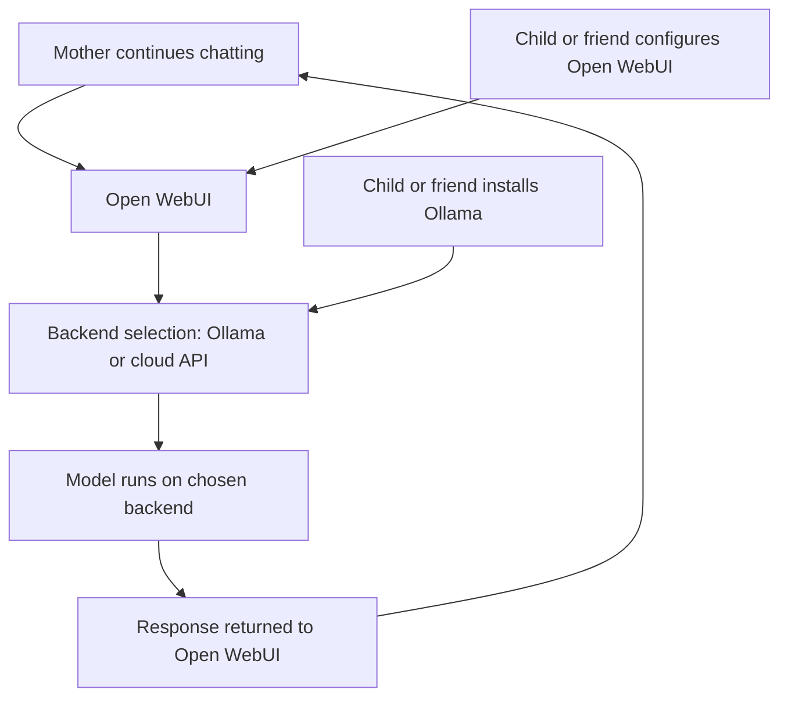
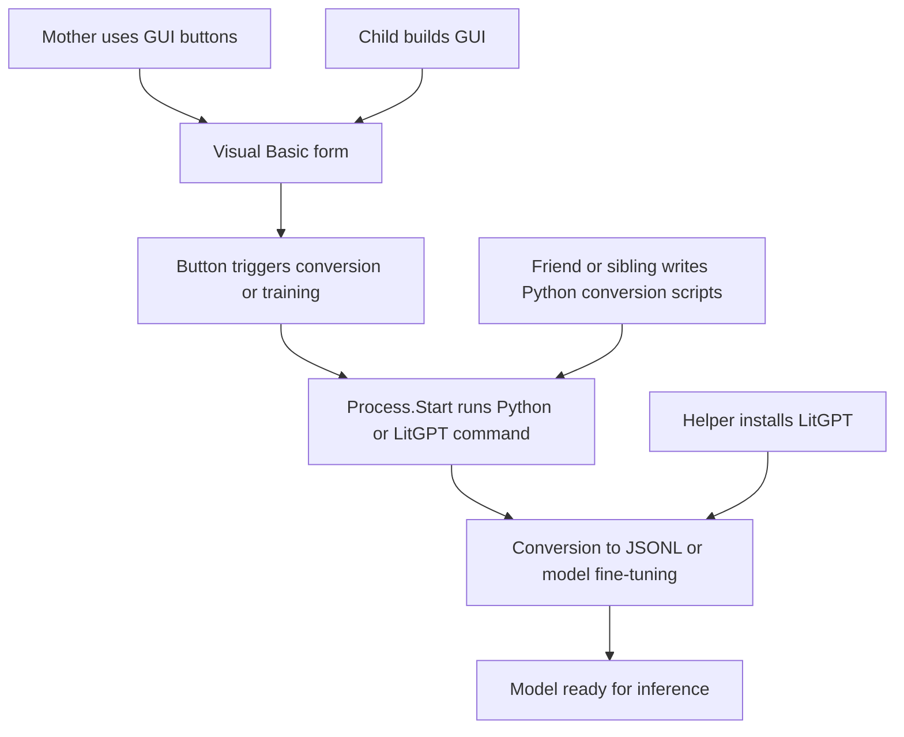

# Setting up Ollama and Open WebUI in a way a non‑technical user can understand and operate

## What Ollama is in practical terms
Ollama is a small program that runs AI models on a computer. It handles:

- downloading a model  
- keeping it ready  
- answering questions when another program asks  

A non‑technical user does not need to know how it works internally. They only need to know:

- it must be installed once  
- it must stay running in the background  
- it provides the “engine” that other tools use  

A technical friend or family member can install it by following the official instructions for Windows, macOS, or Linux. These instructions are written step‑by‑step and do not require guessing.

---

## What Open WebUI is in practical terms
Open WebUI is a website that runs on the user’s own computer. It provides:

- a chat window  
- buttons for settings  
- a list of available models  
- a place to type questions  

It connects to Ollama automatically once configured.  
The non‑technical user only needs to:

- open a browser  
- go to the local address (usually shown after installation)  
- start chatting  

Everything else is handled by the person who sets it up.

---

## What a non‑technical user needs to ask for
A non‑technical user only needs to know how to ask for help in simple terms. Typical requests:

- “Please install Ollama so I can run local AI models.”  
- “Please set up Open WebUI so I can use it in my browser.”  
- “Please add the model I want to use.”  
- “Please make sure it starts automatically when I turn on the computer.”  

These requests are enough for a technical helper to complete the setup.

---

## Manuals and guides that are appropriate
A technical helper can rely on:

- the official Ollama installation guide for the operating system  
- the Open WebUI documentation for connecting to Ollama  
- the model documentation for any special requirements  

These guides are written for general users and do not require deep expertise.

---

## Alternatives if the computer is older or weaker
Different computers handle AI models differently. A helper can choose:

- **Small models** for older laptops  
- **Medium models** for typical home desktops  
- **Large models** for gaming PCs or workstations  

If the computer cannot run models locally, alternatives include:

- using cloud‑based AI services  
- using a remote computer in the home  
- using a lightweight model that fits the hardware  

The non‑technical user does not need to choose; the helper selects the appropriate option.

---

## How much Open WebUI supports other systems
Open WebUI can connect to several types of AI backends:

- **Ollama** for local models  
- **OpenAI‑style APIs** for cloud models  
- **LitGPT servers** if someone runs a custom model  
- **LM Studio** if installed as a local backend  
- **ChatGPT or Copilot** through API keys  

This means the user can switch between:

- local models  
- cloud models  
- fine‑tuned models  
- experimental models  

without changing the interface.

---

## How much each component is needed
- **Ollama** is needed for running local models.  
- **Open WebUI** is needed for a simple, browser‑based interface.  
- **LitGPT** is optional and only needed if someone wants to fine‑tune models.  
- **LM Studio** is optional and provides another local backend.  
- **ChatGPT and Copilot** are optional cloud services.  

A non‑technical user only needs Ollama and Open WebUI for a complete local setup.

---

## Role diagram: how the setup works for a family

# Setting up LitGPT, using generic “initial cards”, converting Anki decks to JSONL, and turning all daily commands into a GUI

## LitGPT setup in practical terms
LitGPT is a framework for running and fine‑tuning language models. A helper installs it once by following the official instructions for the operating system. After installation, LitGPT can:

- run a model  
- fine‑tune a model  
- serve a model through an API endpoint  

A non‑technical user does not interact with LitGPT directly. They only use the GUI that the child or helper builds.

---

## Using generic “initial cards” for LitGPT
LitGPT supports training and fine‑tuning with JSONL files. These files contain:

- an instruction  
- an input (optional)  
- an output  

Generic “initial cards” are simply ready‑made JSONL entries that act as the model’s starting examples. They can be:

- downloaded from public sources  
- written manually  
- generated from existing notes or flashcards  

LitGPT treats these entries as training data. The helper places them in the correct folder, and LitGPT uses them during fine‑tuning.

---

## Converting Anki decks to JSONL
Anki decks can be exported as:

- `.apkg` files  
- `.csv` files  

A helper or friend can convert them to JSONL using a Python script. The script reads each card and produces entries that LitGPT understands. The conversion process follows the same pattern described earlier:

- a Python script with a `main` entry point  
- a command that runs it  
- a GUI button that launches the command  

This allows the mother to convert decks without touching the command line.

---

## Connecting these tasks to a GUI
A Visual Basic form can provide:

- a button to choose an Anki deck  
- a button to convert it to JSONL  
- a button to start LitGPT fine‑tuning  
- a button to run the fine‑tuned model  
- a button to open the inference interface  

Each button triggers a single event. The event launches the appropriate command. The mother interacts only with the GUI.

---

## Role diagram: how LitGPT, conversion scripts, and the GUI interact

# Setting up LitGPT, using generic starter cards, converting Anki decks to JSONL, and turning all recurring commands into a GUI

## Installing LitGPT in practical terms
LitGPT is installed once by a helper who follows the official instructions for the operating system. The installation provides:

- the LitGPT command runner  
- configuration files  
- training and inference scripts  
- the ability to serve a model through an API endpoint  

A non‑technical user does not interact with LitGPT directly. After installation, all actions can be triggered through a GUI.

---

## Using generic starter cards (“initial cards”)
LitGPT fine‑tuning uses JSONL files. These files contain entries such as:

- an instruction  
- optional input  
- the expected output  

Generic starter cards are simply ready‑made JSONL entries that act as the model’s initial examples. They can be:

- downloaded from public sources  
- created manually  
- generated from existing notes or flashcards  

A helper places these JSONL files in the correct folder. LitGPT uses them automatically during fine‑tuning.

---

## Converting Anki decks to JSONL
Anki decks can be exported as `.apkg` or `.csv`. A Python script can convert them to JSONL. The script typically:

- reads each card  
- extracts the front and back  
- writes a JSONL entry for each pair  

The script includes a `main` entry point so it can be run directly.  
A child can connect this script to a GUI button, so the mother selects a deck and the conversion happens automatically.

---

## Connecting LitGPT tasks to a GUI
A Visual Basic form can provide:

- a button to choose an Anki deck  
- a button to convert it to JSONL  
- a button to start fine‑tuning  
- a button to run the fine‑tuned model  
- a button to open the inference interface  

Each button triggers a single event. The event launches the appropriate command.  
The mother interacts only with the GUI.

---

## Role diagram: how LitGPT, conversion scripts, and the GUI interact

This diagram shows the separation of roles:

- The mother uses the GUI  
- The child builds the GUI  
- A friend or sibling writes conversion scripts  
- A helper installs LitGPT  

The mother never sees the command line.

---

## Autoloading tasks at startup
A GUI program can:

- start automatically when Windows starts  
- load the last used model  
- show buttons for daily tasks  
- remember file locations  

This removes the need for repeated setup. The mother opens the computer and the interface is ready.

---

## Summary
LitGPT is installed once by a helper. Generic starter cards are JSONL entries that LitGPT uses for training. Anki decks can be converted to JSONL through Python scripts. A child can wrap all commands in a Visual Basic GUI with buttons and dialogs. The mother interacts only with the GUI, while helpers handle installation and configuration.
