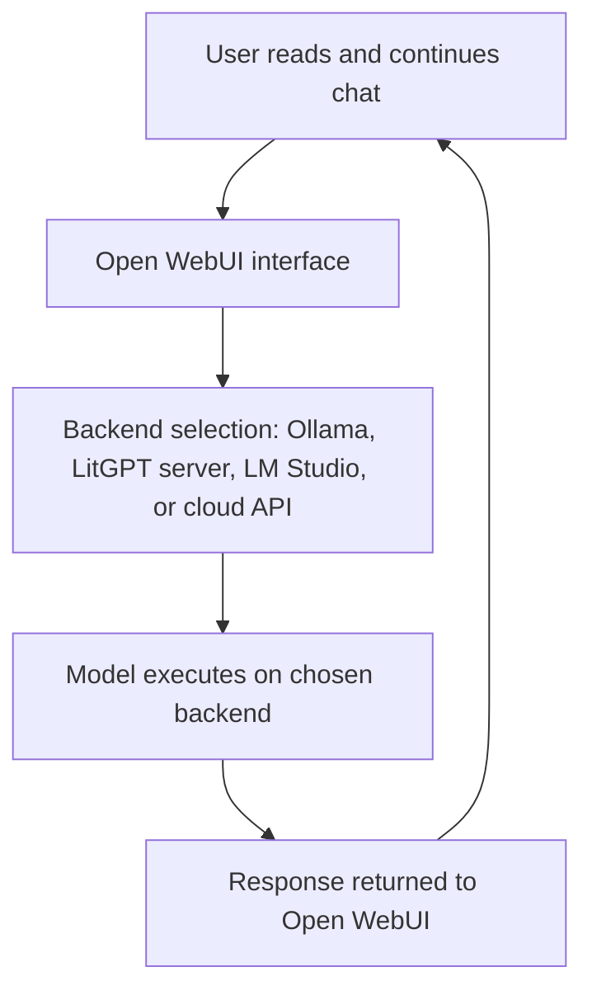

# Using Open WebUI and Ollama together for a complete inference experience

## Overview
Open WebUI provides a browser‑based interface for interacting with local AI models. Ollama provides a model runner that downloads, manages, and executes models. When combined, they form a complete inference environment that requires no command‑line interaction once installed and configured. A child or beginner can expose all needed actions through a GUI, while the underlying tools remain flexible and powerful.

---

## How Open WebUI uses Ollama
Open WebUI can connect directly to an Ollama backend. When configured this way:

- Ollama handles model installation  
- Ollama runs the model  
- Open WebUI provides the chat interface  
- The user interacts only through the browser  

This covers the full inference workflow:

- Selecting a model  
- Sending prompts  
- Viewing responses  
- Managing conversation history  

The mother only opens a browser window; the child configures the backend once.

---

## Support for OpenAI‑style APIs
Open WebUI includes support for the general OpenAI API format. This means:

- Tools expecting an OpenAI‑style endpoint can point to Open WebUI  
- Applications built for OpenAI models can be redirected to local models  
- The user can switch between local and remote models without changing the interface  

This gives flexibility without requiring new tools or new habits.

---

## Using LitGPT with its own server
LitGPT can run its own inference server. When used this way:

- LitGPT handles the model  
- The server exposes an endpoint  
- Open WebUI can connect to that endpoint  
- The user interacts through the same browser interface  

This allows experimentation with fine‑tuned models while keeping the interface consistent.

---

## Using LM Studio
LM Studio provides:

- A desktop interface  
- Model management  
- A local API endpoint  

Open WebUI can connect to LM Studio’s endpoint. This allows:

- Switching between LM Studio and Ollama  
- Using LM Studio’s model catalog  
- Keeping the same chat interface  

The user sees no difference; the backend changes only in configuration.

---

## Using ChatGPT or Copilot
ChatGPT and Copilot are cloud‑based services. Open WebUI can:

- Connect to them through API keys  
- Present them as selectable models  
- Allow switching between local and cloud inference  

This gives the user a unified interface for all models, local or remote.

---

## How much each component is needed
- **Ollama** is needed for local model execution and management.  
- **Open WebUI** is needed for a unified, browser‑based interface.  
- **LitGPT** is needed only if fine‑tuning or custom training is desired.  
- **LM Studio** is optional; it provides an alternative local backend.  
- **ChatGPT and Copilot** are optional cloud services for comparison or fallback.  

A minimal setup uses only:

- Ollama  
- Open WebUI  

Everything else is optional.

---

## Role diagram: how the components interact

This diagram shows that the user interacts only with the browser. The backend can be swapped without changing the user’s workflow.

---

## Summary
Open WebUI and Ollama together provide a complete inference experience. Open WebUI supports OpenAI‑style APIs, LitGPT servers, LM Studio, and cloud services such as ChatGPT and Copilot. Only Ollama and Open WebUI are required for a full local setup; everything else is optional. The user interacts through a browser, while configuration and backend selection are handled once by a child or beginner who follows the documentation.
