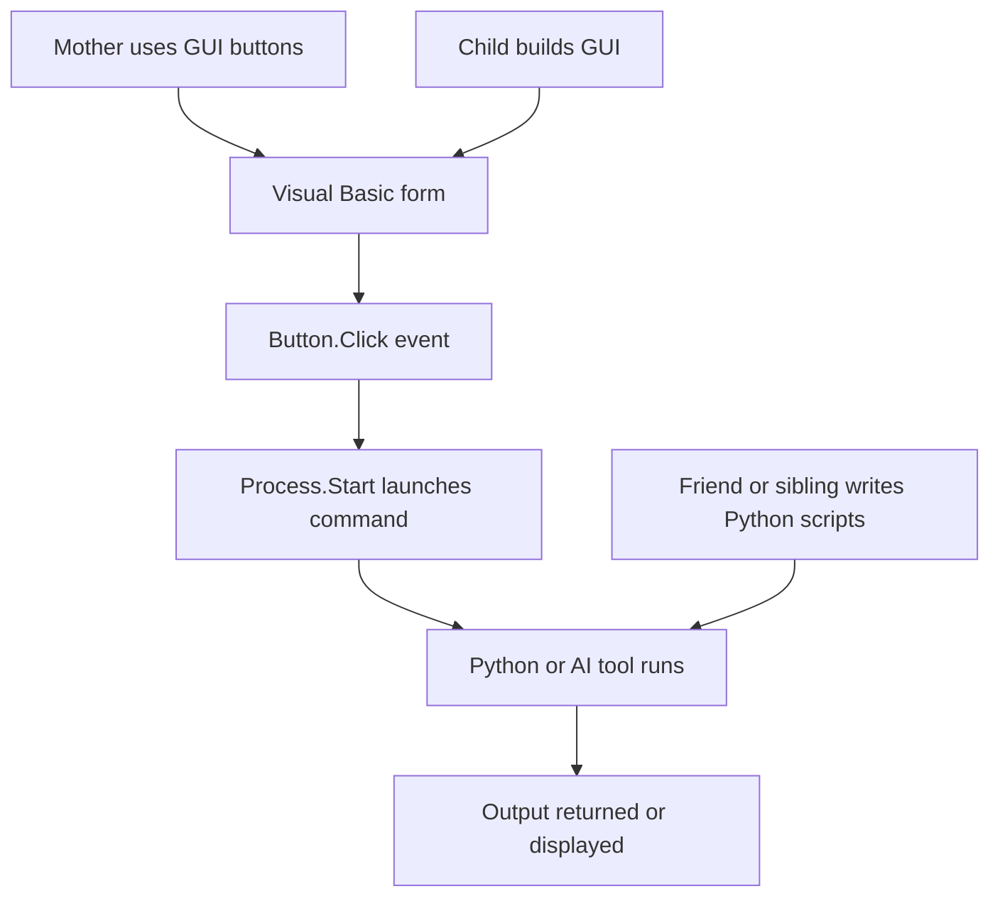
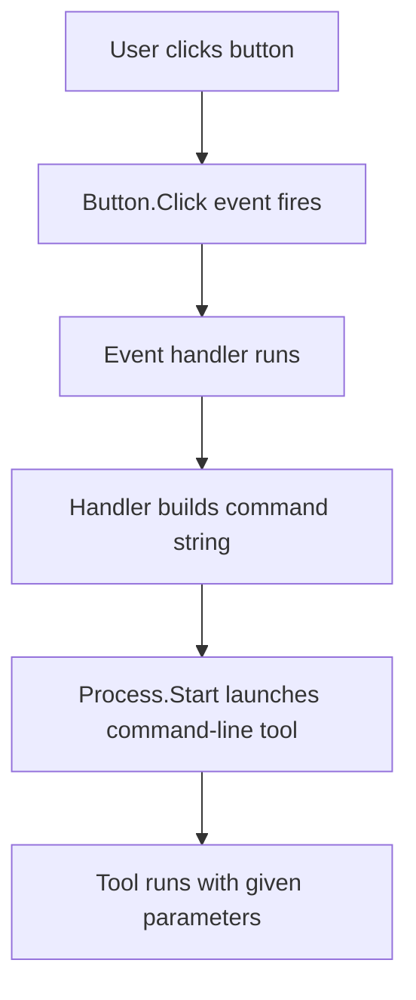
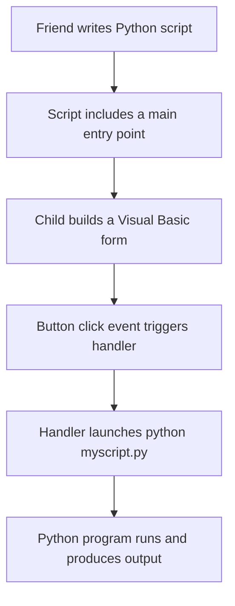

# Introduction
This section describes how a family can build a complete, GUI‑based workflow around AI tools without requiring the mother (or any non‑technical user) to touch the command line. The goal is to document the task, the possibilities, and the structure clearly enough that a reader can understand the whole solution at a glance and then focus only on the parts they do not yet know. The approach uses simple Visual Basic forms, Python scripts written by friends or family, and standard Windows dialogs to replace command‑line parameters.

---

# Replacing command‑line tasks with GUI actions
A command‑line tool normally expects parameters such as filenames, text, or numbers. A Visual Basic form replaces these with:

- Buttons  
- File‑open dialogs  
- Text boxes  
- Drop‑down lists  

Each button triggers a single event, and the event launches the underlying tool with the correct parameters.

Example: a command that normally requires a filename

```bash
python smartcard.py --input mydoc.pdf
```

becomes a GUI action:

```vb
If OpenFileDialog1.ShowDialog() = DialogResult.OK Then
    Process.Start("cmd.exe", "/c python smartcard.py --input """ & OpenFileDialog1.FileName & """")
End If
```

The mother clicks a button, chooses a file, and the task runs.

---

# Providing AI inference through buttons
Inference tools such as LitGPT or Open WebUI normally require commands. A child can turn them into simple buttons:

- Run AI  
- Open Chat  
- Start Model  

Examples:

```vb
Process.Start("cmd.exe", "/c python litgpt/chat.py --config configs/model.yaml")
```

or

```vb
Process.Start("http://localhost:3000")
```

The mother interacts only with the GUI.

---

# Converting decks, JSON, and training data
Tasks such as converting Anki decks, JSON files, or training data often require long commands. A child can create:

- Convert Deck  
- Prepare Training Data  
- Export Notes  

Each button runs a single command with the selected file.

```vb
Process.Start("cmd.exe", "/c python convert.py """ & TextBox1.Text & """")
```

The GUI becomes a collection of hooks into the AI ecosystem.

---

# Role diagram: how the family cooperates



This diagram shows the separation of roles:

- The mother uses the GUI  
- The child builds the GUI  
- A friend or sibling writes the Python logic  
- The AI tools run behind the scenes  

---

# Why the mother now has complete “hooks” into AI
Every AI‑related action becomes:

- a button  
- a dialog  
- a simple form  

She can:

- run inference  
- open the AI chat  
- generate smartcards  
- convert decks  
- prepare documents  
- launch training  
- run maintenance tasks  

without typing anything.

The child or family friend only needs to follow a simple manual:

- write or obtain a Python script  
- ensure it has a `__main__` entry point  
- connect it to a button in Visual Basic  

Once connected, the mother has a stable, safe interface.

---

# Why this approach works for beginners
The child edits:

- button text  
- a single line in the event handler  
- optional text boxes for parameters  

The Python author does not need to know Visual Basic.  
The mother does not need to know Python or the command line.

This division of labor lets the family build a complete AI workflow with minimal complexity.

# Well what has this folder even to do with programming?

I am programmer, but some things I really called "fancy" as a child:
- Using "GameWizard" for 386 for hacking games.
- Microsoft Resource Workshop (sometimes called Resource Editor, RESEDIT, or Borland Resource Workshop depending on the version you used).
  - It allows to open win31 app and change menus, dialogs, pictures etc.
  - It's for editing windows resource format and allowed to "tweak" apps into your custom apps.
    - It's the child programmer's interest who does not give a damn to create "real" programs, but constantly hacks around their computer and anything what can be done.
- Using batch (*.bat) files, tweaking it with autoexec.bat, and using anything else to get things going.
  - Indeed smurfing around windows registry and conf files, scanning the memory and filesystem rather than reading doc, and running long custom pascal or basic programs
    which figure out the format of this.
  - For example, I hacked into Supaplex (game) level file and my family created new levels, because binary data was repeating.
  - I would never do so much hex and details as child: in fact, I did not know libraries for a brief moment, but managed to read everything in binary.

## This does not have to do with programming your watch, calculator or a computer that thing what basic and cobol do not have to do with it:

***Basic***
- It's generally told you lose habits if you program it.
- It's actually not programming, but a basic model building and you can well do if you hack lines and symbols on existing examples,
  - really, I used it to learn if/then, and I would never understood goto: how it's all based on one, and not four primitives.
- Syntax is not union, but semantics is - it is expressing each semantic element in custom fashion:
  - A circle in custom syntax: `Circle (500, 500), 49`
  - A circle in unified syntax: `Circle(500, 500, 49)`, `Circle(p, 49)`, `Circle((500, 500), 49)` - each of them allows reflection on syntax
  - Artificial Intelligence, practically, is end of loss of custom syntax
  - This was not a bug, but feature for beginners: recognizing their favourite semantics in ascii art of well-known ways to write it
    - This actually means you have a bunch, like 20, custom syntax elements in your everyday use
    - This does not stop you from generating code
  - It's not OOP: the quick basic was not OOP and thus, it did not allow to encapsulate your objects into classes
    - Rather, you counted pointers
- It is made as a sandbox.
   
***Cobol***
- It's told do not learn COBOL at all: to be first programming rule
- Actual background: COBOL is not a language for programming, but an early attempt to get around it
  - Programmers won't find their favourite math: rather, like in basic, custom syntax is used for science and business language expressions and mathematics

For me, each language is for learning it's culture, and definitely no "habits" are carried from one to another - take an evening in nature, for example, to get your head fresh.

# Command‑line use of four common tools, with stable one‑line commands

The focus is on whether everyday activities can be done through **simple, static command lines** once the environment is set up. The four tools are:

- Ollama  
- LitGPT  
- Python scripts  
- Flask applications  

The activities are expressed in plain human terms:

1. **Preparing or collecting material** (documents, notes, text sources)  
2. **Preparing learning material** (flashcards, structured text, training data)  
3. **Using or training an AI model** (chatting, running inference, or fine‑tuning)

The question is whether each tool can be used with **single, stable commands** during normal use, with only model installation requiring additional commands.

---

## Ollama

Ollama is designed for command‑line simplicity. After installation and after pulling a model, the user can rely on a **single static command** for most sessions.

### Typical one‑line usage

```bash
ollama run mymodel
```

The only part that changes is the **model name**. Everything else stays constant.

### Activity mapping

- **Preparing/collecting material:**  
  Usually done outside Ollama. If a helper writes a script that feeds material into Ollama, the user still runs a **single static command**.

- **Preparing learning material:**  
  Ollama itself does not generate training sets, but a helper can wrap preprocessing into a script. The user still runs one command.

- **Using/training the model:**  
  Inference is always a one‑liner.  
  Fine‑tuning is not part of Ollama, so no extra complexity here.

### Stability

Once installed and once a model is pulled, the user’s command remains:

```bash
ollama run mymodel
```

Only the model name changes when switching models.

---

## LitGPT

LitGPT supports both inference and fine‑tuning from the command line. The raw commands are long, but they can be wrapped so the user only sees **one stable command**.

### Typical one‑line usage (raw)

```bash
python litgpt/chat.py --config configs/model.yaml
```

```bash
python litgpt/finetune/lora.py --config configs/finetune.yaml
```

These commands do not change unless the helper changes configuration files.

### Activity mapping

- **Preparing/collecting material:**  
  Usually done by Python scripts, not LitGPT directly.

- **Preparing learning material:**  
  A helper can create a script that always uses the same config and data paths.  
  The user runs a single command such as:

  ```bash
  train-model
  ```

- **Using/training the model:**  
  Inference and fine‑tuning can each be wrapped into a stable command.  
  The user does not need to change parameters.

### Stability

LitGPT itself requires parameters, but once wrapped, the user’s commands remain static.

---

## Python scripts

Any Python program with a `__main__` entry point can be executed with a single command. Helpers can package scripts so the user runs them without parameters.

### Typical one‑line usage

```bash
python myscript.py
```

Or, if installed as a console script:

```bash
myscript
```

### Activity mapping

- **Preparing/collecting material:**  
  A script can scan folders, validate files, or convert formats.  
  The user runs one command.

- **Preparing learning material:**  
  A script can generate flashcards or structured text.  
  The user runs one command.

- **Using/training the model:**  
  A script can orchestrate training or inference.  
  The user runs one command.

### Stability

Python scripts are the easiest way to guarantee **stable, single‑line commands** for all three activities.

---

## Flask applications

Flask applications provide graphical interfaces but are still launched from a single command.

### Typical one‑line usage

```bash
python app.py
```

Or:

```bash
flask run
```

### Activity mapping

- **Preparing/collecting material:**  
  A Flask UI can let users upload or manage files.  
  The user launches it with one command.

- **Preparing learning material:**  
  A Flask UI can let users edit flashcards or structured text.  
  Again, one command.

- **Using/training the model:**  
  A Flask UI can act as a chat interface or training dashboard.  
  Still one command.

### Stability

Once installed, the command to start the UI does not change.

---

## Overall conclusion

For all four tools:

- After installation and initial setup,  
- After models are downloaded,  
- After helpers prepare scripts or configuration files,

**the user can perform all three activities with single, static command lines**.

The only time commands change is when:

- A new model is installed (the name after `run` changes), or  
- A helper updates internal scripts (the user’s command stays the same).

This makes the workflow predictable and easy for non‑technical users while still allowing complex behavior behind the scenes.

# Visual Basic, simple commands, and how different Visual Studio editions fit children, hobbyists, and home users

## Visual Basic for children
Visual Basic is often a good fit for children because it connects a **button on the screen** with a **single line of code**. The child presses a button, sees something happen, and immediately understands the cause–effect link. It also supports the idea of “one command does one thing”, which matches the way children experiment: change a line, press a button, observe the result.

The language tolerates small mistakes, the editor highlights problems clearly, and the runtime model is simple. A child can modify a recognized line (“change the text”, “move the shape”, “change the color”) without needing to understand the entire program. This mirrors the way children once modified BASIC examples on home computers: adjust a line, run it, see what happens.

## Installing Visual Studio Express
Visual Studio Express was a free edition aimed at beginners, students, and hobbyists. It installs with a guided setup and includes the Visual Basic environment, the UI designer, and the compiler. It was suitable for:

- **Educational settings:** easy to install, no licensing cost, simple UI.
- **Non‑profit or community centers:** free and lightweight, enough for teaching.
- **Home or office users:** straightforward installation, no configuration needed.

A side note: standalone compilers (such as the free .NET SDK) are even more permissive and cost‑free, but they do not include the visual designer or the simplified environment. Express editions were designed to be friendlier for beginners.

## UI editor and one‑liner actions
The UI editor in Visual Studio Express lets the user drag a button onto a form and double‑click it. This creates a single event handler. Inside that handler, one line can perform a meaningful action:

```vb
Label1.Text = "Hello"
```

This matches the idea of “single command triggers a visible change”. Children can modify that line, try different commands, or experiment with behavior without risk. The environment isolates the program, so mistakes are not dangerous.

The editor also shows properties visually, so a child can change colors, text, or size without writing code. When they do write code, it is usually one or two lines at a time, reinforcing the idea that small changes produce immediate results.

## Visual Studio Professional
Visual Studio Professional adds features that matter to experienced developers but not to beginners:

- Advanced debugging tools  
- Profiling  
- Larger project templates  
- Integration with enterprise systems  

For a child or hobbyist, these additions do not change the basic workflow. The UI designer and the ability to attach a single line to a button remain the same. The environment is heavier, but the core experience is unchanged.

## Mono and cross‑platform options
Mono allows Visual Basic and .NET applications to run on Linux and macOS. It is useful when the goal is to run simple programs across different systems. The trade‑offs:

- **Gains:** cross‑platform execution, open‑source ecosystem  
- **Losses:** the UI designer is less polished, and compatibility is not perfect  

For simple educational programs, Mono works well enough, but the experience is smoother on Windows.

## Alternatives for simple, button‑driven programming
Several environments make it even easier to emulate the “press a button, run a line” model:

- Block‑based systems (Scratch, MakeCode)  
- Python with a minimal GUI toolkit  
- Small web‑based editors with buttons triggering JavaScript lines  

These alternatives reduce syntax concerns even further, but they do not replace the feeling of editing a real program file and seeing the result in a window. Visual Basic remains one of the simplest ways to connect a GUI element to a single line of imperative code.

## Summary
Visual Basic suits children because it supports experimentation through small, isolated changes. Visual Studio Express provides a free, simple environment with a UI editor that encourages one‑line actions. Visual Studio Professional adds advanced tools but does not change the beginner workflow. Mono extends compatibility but with some limitations. Other environments exist, but Visual Basic remains one of the clearest ways to learn programming through direct manipulation of buttons and single‑line commands.

# Visual Basic, installation paths, costs, and how children, parents, and hobbyists grow into more advanced tools

## Visual Basic as a child‑friendly starting point
Visual Basic works well for children because it connects a visible object on the screen with a single action. A button can trigger one line of code, and that line can be changed, tested, and understood without learning the entire language. This mirrors how technically curious children experiment: change something recognizable, run it, observe the effect.

A child who already helps family members with technology can use this pattern to build small tools. For example, a child might set up an AI model for their mother and then create a simple graphical interface with a button that sends text to the model. The child edits one line in the button’s event handler, and the whole program changes behavior.

---

## Installation and cost

### Visual Studio Express / Community
Visual Studio Express was free and designed for beginners. Its successor, Visual Studio Community, fills the same role today. Installation is straightforward: download the installer, choose the language edition, and let it configure itself. It includes the UI designer and compiler. It is suitable for home users, schools, and non‑profits because it requires no payment and no license management.

### Visual Studio Professional
Visual Studio Professional requires a paid license. It adds advanced debugging, profiling, and enterprise features. A child does not need these features, and most hobbyists never reach a point where they are required. Payment becomes relevant only when someone works professionally or needs integration with large systems.

### Mono
Mono is free and open‑source. Installation depends on the operating system: package managers on Linux, installers on macOS, and optional components on Windows. It allows Visual Basic and C# programs to run outside Windows. The trade‑off is that the UI designer is less polished, and compatibility is not perfect, but for simple educational programs it works well.

---

## UI editor and one‑line actions
The Visual Studio UI editor allows dragging a button onto a form and double‑clicking it. This creates a single event handler. Inside that handler, one line can change text, color, or behavior. Children can modify that line without understanding the rest of the program. This supports experimentation and learning through small, safe steps.

Running a program is also a single action: press “Start”. The connection between editing one line and seeing the result immediately is what makes Visual Basic approachable.

---

## Skills, abilities, and time investment
A child needs only a few abilities to begin:

- Recognizing familiar words in code  
- Understanding that one line causes one effect  
- Being willing to try changes and observe results  

Time investment is small. A child can learn to modify button actions in minutes. Creating a simple interface takes an afternoon. More advanced concepts—variables, loops, or events—come naturally as the child experiments.

Running command‑line tools such as AI models requires a different skill set: typing commands, understanding that each command performs a task, and recognizing that some commands stay the same across sessions. A technically curious child can learn this quickly, especially if they already enjoy exploring computers.

A parent can support this by writing Python scripts that handle background tasks. The child interacts with the graphical interface, while the parent maintains the underlying logic. The parent does not need to write Visual Basic; they can choose C# or Python. The joke is that some parents avoid Visual Basic because they fear “basic habits”, so they choose C# instead.

---

## Installation summary

### Visual Studio Express / Community
- Free  
- Download installer  
- Choose language edition  
- Includes UI designer and compiler  
- Suitable for home, school, and hobby use  

### Visual Studio Professional
- Paid license  
- Same installation process  
- Adds advanced tools  
- Useful only when working professionally  

### Mono
- Free  
- Installed through package managers or installers  
- Runs .NET programs on Linux and macOS  
- UI tools are less polished but functional for simple projects  

# Creating a simple Visual Basic app in Visual Studio Express, adding buttons, and connecting it to AI workflows

## Creating a new Visual Basic application
Visual Studio Express (and its successor, Visual Studio Community) makes the first steps straightforward.

- Start the program  
- Choose **New Project**  
- Select **Windows Forms Application (Visual Basic)**  
- Give it a name and confirm  

A blank window appears. This is the form the user will see.

## Adding buttons to the form
The toolbox contains UI elements. Drag a **Button** onto the form.  
Double‑click the button to open its event handler. Inside the handler, one line can perform a meaningful action:

```vb
Label1.Text = "Running model..."
```

This pattern—one button, one line—is the core of why Visual Basic works well for beginners.

## Connecting a button to LitGPT fine‑tuning
LitGPT fine‑tuning is done through a command line. A Visual Basic button can trigger that command by launching a process.

```vb
Process.Start("cmd.exe", "/c python litgpt/finetune/lora.py --config configs/train.yaml")
```

The child sees a button; the underlying command does the work. The configuration file stays constant, so the command remains stable across sessions.

## Running a fine‑tuned model from the graphical app
Inference uses a similar pattern. A button can call the inference script:

```vb
Process.Start("cmd.exe", "/c python litgpt/chat.py --config configs/train.yaml")
```

The graphical interface becomes a launcher for the model. The user does not need to type commands; the button hides the complexity.

## Using Open WebUI for inference
Open WebUI provides a browser‑based interface for models. After installation, it usually runs with a single command. A Visual Basic button can open the browser:

```vb
Process.Start("http://localhost:3000")
```

This means the program may only need a few buttons:

- Train model  
- Run model  
- Open WebUI  
- Exit  

The child builds the interface; the parent or helper configures the underlying commands.

## Why this works well for children and families
A technically curious child can set up an AI model for a parent and build a small interface around it. The child edits recognizable lines in Visual Basic, while the parent can maintain Python scripts if more workload is needed. The parent does not need to write Visual Basic; they can use C# or Python. The joke is that some parents avoid Visual Basic because they fear “basic habits”, so they choose C# instead.

## Installing the example environments

### Visual Studio Express / Community
- Free  
- Download installer  
- Choose Visual Basic  
- Includes UI designer and compiler  
- Suitable for home and educational use  

### Visual Studio Professional
- Paid  
- Same installation process  
- Adds advanced debugging and enterprise features  
- Not needed for children or hobbyists  

### Mono
- Free  
- Installed via package managers or installers  
- Runs .NET programs on Linux and macOS  
- UI tools are less polished but usable for simple projects  

# Visual Basic button–to–command flow, with all inner fences escaped and no stray backticks

## Filling parameters for command‑line tools
A Visual Basic program can pass values to a command‑line tool in two simple ways:

- Asking the user for a number or text through a one‑line dialog  
- Reading values from form elements such as text boxes or dropdowns  

Both methods end in the same action: the program builds a command string and launches it.

Example using a dialog:

```vb
Dim value = InputBox("Enter a number:")
Process.Start("cmd.exe", "/c mytool.exe --value " & value)
```

Example using a text box:

```vb
Process.Start("cmd.exe", "/c mytool.exe --value " & TextBox1.Text)
```

The child sees a button; the program handles the command.

---

## What connections exist inside the program
A Visual Basic form contains:

- Controls (buttons, text boxes, labels)  
- Events (Button1.Click, Form.Load)  
- Event handlers (the code that runs when an event fires)  

The event handler is where the command is built and executed. The chain is short and predictable.

---

## Mermaid diagram of the internal flow



This shows that the complexity is linear: one action leads to one event, which leads to one command.

---

## What this complexity means for different children

### A child in class 3, strong in math and physics
This child usually understands:

- Cause and effect  
- Simple sequences  
- Changing a number and seeing a different result  
- The idea that a button “does something”  

They can modify the command, change parameters, or add a new button without difficulty. They may enjoy experimenting with different values and observing how the AI model responds.

### A child who is not strong in math or physics
This child can still succeed because:

- Visual Basic hides the structure  
- The UI editor is drag‑and‑drop  
- The event handler is one small piece of code  
- They only need to change a recognizable line  

The complexity is procedural, not mathematical. Children who enjoy tinkering often do well even without strong math skills.

---

## Time and effort required

### Creating the form
- 5 minutes to create a new project  
- 5 minutes to drag buttons and text boxes  
- 1 minute to rename them  

### Connecting a button to a command
- 10 seconds to double‑click the button  
- 1–2 minutes to paste a command into the handler  
- 1 minute to test it  

### Adding parameters
- 1 minute to add a text box  
- 1 minute to read its value in the handler  

### Total time for a simple AI launcher
About 15–20 minutes for a child who has never done it before.

---

## Summary
Visual Basic Express allows a child to build a graphical interface that launches command‑line tools with one‑line handlers. The complexity is small and linear, and the child only edits recognizable lines. Children strong in math and physics understand the structure quickly; children who are not still succeed because the environment is visual and forgiving.

# How friends create simple Python programs, how `if __name__ == "__main__"` keeps them runnable, and how a child can turn them into GUI apps — with role diagrams and a path toward C#

## Python programs written by friends or family
A typical beginner‑friendly Python script has two parts:

- **Reusable functions**  
- **A runnable entry point** guarded by  
  `if __name__ == "__main__":`

This pattern ensures the file behaves as a **program**, not a library.  
It can be run directly from the command line, and its main components can still be imported elsewhere.

Example:

```python
def compute(x, y):
    return x + y

def main():
    print(compute(2, 3))

if __name__ == "__main__":
    main()
```

Running it:

```bash
python myscript.py
```

This is all a child needs: a runnable script with predictable behavior.

---

## Why this structure matters
The `if __name__ == "__main__"` guard ensures:

- The program **runs normally** when executed from the command line  
- The functions **can be reused** if someone imports the file  
- The child can call the script from Visual Basic or any GUI without modification  

This makes Python a good “family language”: one person writes the logic, another wraps it in a GUI.

---

## How a child turns such a script into a GUI program
A child using Visual Basic Express can:

- Create a new Windows Forms project  
- Add a button  
- Double‑click the button to open its event handler  
- Launch the Python script with one line

Example:

```vb
Process.Start("cmd.exe", "/c python myscript.py")
```

If the Python script expects parameters:

```vb
Process.Start("cmd.exe", "/c python myscript.py " & TextBox1.Text)
```

The child does not need to understand Python.  
They only need to know that pressing the button runs the script.

---

## Role diagram: how the pieces interact



This diagram shows the separation of roles:

- The friend or parent writes the logic  
- The child builds the interface  
- The program becomes usable by anyone  

---

## Why this is easy for beginners
The child only edits:

- Button text  
- A single line in the event handler  
- Optional text boxes for parameters  

There is no need to understand:

- Python syntax  
- Libraries  
- Data structures  
- Packaging  

The GUI is a thin wrapper around a command.

---

## Why children later scale up to C#
Visual Basic teaches:

- Events  
- Buttons  
- Forms  
- Simple logic  
- Cause–effect programming  

C# uses the same concepts but adds:

- Stronger typing  
- Modern libraries  
- Better tooling  
- Wider community support  

The transition is natural because:

- The Visual Studio environment is the same  
- The UI designer is the same  
- The event model is the same  
- Only the syntax changes  

A child who starts with Visual Basic often moves to C# when they want:

- More performance  
- More advanced features  
- Access to modern frameworks  
- A language used in professional settings  

The joke is that some parents avoid Visual Basic because they fear “basic habits”, so they choose C# instead — but the child can still start with VB and switch later without friction.

---

## Summary
Python scripts written by friends or family become runnable tools when they include a `__main__` guard. A child can wrap these scripts in a Visual Basic GUI by connecting a button to a single command. The roles remain clean: one person writes logic, another builds the interface. This approach scales naturally toward C#, which uses the same environment but offers more advanced capabilities.

# How a family can replace command‑line tasks with a GUI built by a child, and how this gives the mother complete “hooks” into AI

## Why the mother never needs the command line
A command‑line tool becomes a button when a child wraps it in a Visual Basic form.  
Anything that normally requires typing:

- running inference  
- launching Open WebUI  
- starting a LitGPT chat  
- generating a smartcard file  
- converting Anki decks or JSON  
- preparing documents for an AI model  

can be turned into:

- a button  
- a file‑open dialog  
- a text box  
- a drop‑down list  

The mother interacts only with the GUI.  
The child (or a sibling, or a family friend) handles the command‑line details once.

---

## How a child replaces command‑line parameters with dialogs
Visual Basic provides built‑in dialogs:

- file open  
- folder select  
- save file  
- text input  

A command that normally requires a filename:

```bash
python smartcard.py --input mydoc.pdf
```

becomes a button that opens a file dialog:

```vb
If OpenFileDialog1.ShowDialog() = DialogResult.OK Then
    Process.Start("cmd.exe", "/c python smartcard.py --input """ & OpenFileDialog1.FileName & """")
End If
```

The mother clicks the button, chooses a file, and the task runs.

---

## How inference becomes a button
Inference tools such as LitGPT or Open WebUI normally require commands.  
A child can turn them into:

- **Run AI**  
- **Open Chat**  
- **Start Model**  

Examples:

```vb
Process.Start("cmd.exe", "/c python litgpt/chat.py --config configs/model.yaml")
```

or

```vb
Process.Start("http://localhost:3000")
```

The mother never sees the command.

---

## How conversion tasks become buttons
Tasks like converting Anki decks, JSON files, or training data often require long commands.  
A child can create:

- **Convert Deck**  
- **Prepare Training Data**  
- **Export Notes**  

Each button runs a single command with the selected file.

```vb
Process.Start("cmd.exe", "/c python convert.py """ & TextBox1.Text & """")
```

The GUI becomes a collection of “hooks” into the AI ecosystem.

---

## Role diagram: how the family cooperates


This diagram shows the separation of roles:

- The mother uses the GUI  
- The child builds the GUI  
- A friend or sibling writes the Python logic  
- The AI tools run behind the scenes  

The mother interacts only with the visible layer.

---

## Why this gives the mother complete “hooks” into AI
Every AI‑related action becomes:

- a button  
- a dialog  
- a simple form  

She can:

- run inference  
- open the AI chat  
- generate smartcards  
- convert decks  
- prepare documents  
- launch training  
- run maintenance tasks  

without typing anything.

The child or family friend only needs to follow a simple manual:

- write or obtain a Python script  
- ensure it has a `__main__` entry point  
- connect it to a button in Visual Basic  

Once connected, the mother has a stable, safe interface.

---

## Why this approach works for beginners
The child does not need deep programming knowledge:

- drag a button  
- double‑click it  
- paste a command  
- add a file dialog if needed  

The Python author does not need to know Visual Basic.  
The mother does not need to know Python or the command line.

This division of labor lets the family build a complete AI workflow with minimal complexity.
