# CoPilot extension *LaegnaAI Hook Programming Manual — Introduction for Common Users* begins

## 🌿 **Introduction — Programming as Giving Instructions, Not Writing Code**

This repository brings AI down to the **grassland level**:  
to homes, schools, hobby clubs, small companies, and circles of friends who want to *use* AI, *shape* AI, and *teach* AI — without needing to become software engineers.

Here, **programming** does not mean what people fear it means.  
It does not mean:

- learning algorithms  
- writing complex code  
- understanding compilers  
- building architectures  
- debugging memory leaks  

Instead, programming means something much simpler and more human:

> **Programming is giving instructions.  
> Sometimes in a row.  
> Sometimes only one.  
> Sometimes a single, well‑chosen command.**

A “program” can be:

- a folder full of shortcuts  
- a `.bat` or `.sh` file with three lines  
- a Python script that calls an AI tool  
- a button in a tiny UI  
- a web page that sends a GET request  
- a service that starts on boot  
- a workflow that runs when you click an icon  

This is the kind of programming that **common users** can learn, use, and grow with.

---

## 🧭 **Why this matters for everyday people**

AI tools like **Ollama**, **LitGPT**, and small fine‑tuning frameworks are powerful — but they often speak the language of terminals and commands.  
This repository translates that world into:

- icons  
- buttons  
- folders  
- simple scripts  
- small UIs  
- predictable workflows  
- human‑friendly hooks  

So that:

- a student can run a model for a school project  
- a hobbyist can fine‑tune a personal assistant  
- a small company can test prototypes  
- a family can share a home AI setup  
- a club can maintain a shared model  
- a friend can help another friend remotely  

This is **AI as a community tool**, not a corporate mystery.

---

## 🧩 **Programming as “one good instruction”**

Traditional programming is a long sequence of steps.  
But hook‑based programming often looks like this:

- “Run this model with this prompt.” 
- “Train this deck.” 
- “Start the server.” 
- “Restart the daemon.” 
- “Summarize this file.” 
- “Merge these outputs.” 

One instruction.  
One action.  
One hook.

A common user does not need to write a program.  
They only need to **give the right instruction to the right tool**.

And the helper — a friend, a kid, a hobbyist, a small‑company tech person — builds the hook that makes this instruction easy to give.

---

## 🧱 **Why this scales smoothly**

This repository is designed so that:

- **beginners** can click icons  
- **tinkerers** can edit scripts  
- **hobbyists** can build UIs  
- **admins** can automate services  
- **programmers** can integrate tools  
- **teams** can maintain shared models  
- **companies** can grow into professional workflows  

The same hooks work at every scale.

A school project can become a club project.  
A club project can become a small‑company prototype.  
A prototype can become a real product.

Nothing is wasted.  
Everything grows.

---

## 🧒 **Common users — the center of the system**

This introduction is for **common users**, the people who:

- want to use AI  
- want to teach AI  
- want to organize their documents  
- want to create flashcards  
- want to run inference  
- want to fine‑tune models  
- want to understand their tools  
- want to grow naturally  

Common users include:

### **End users**
- click icons  
- organize documents  
- create decks  
- chat with the AI  
- reinforce its behavior  

### **Friends & family**
- help install tools  
- build simple scripts  
- create small UIs  
- maintain services  
- fix things when needed  

### **Hobbyists & enthusiasts**
- automate workflows  
- build dashboards  
- integrate tools  
- experiment with models  

### **Small companies**
- run prototypes  
- test internal assistants  
- maintain shared models  
- build simple automation  

All of them participate in the same ecosystem.  
All of them use the same hooks.  
All of them grow together.

---

## 🌱 **Closing**

This introduction sets the tone for the entire manual:  
**AI is not only for experts.  
AI is for communities.  
AI is for common users.**

Programming here is not a barrier — it is simply the act of giving instructions, one at a time, through hooks that helpers build and maintain.

This is how AI becomes personal, practical, and shared.

# CoPilot extension *LaegnaAI Hook Programming Manual — Introduction for Common Users* ends

# CoPilot extension *LaegnaAI Hook Programming Manual* begins

## 🎓 **Hook Programming Manual — turning commands into buttons, icons, and simple UIs**

This chapter continues the same structure, tone, and conventions as the previous sections of *LaegnaAI Hooks & Bones*.  
It explains how a tech‑savvy helper — a curious kid, a DIY father, a sibling who likes tinkering, a hobbyist admin, or a programmer — can turn **command‑line AI tools** into **graphical, clickable, friendly hooks**.

The goal is always the same:

> **End users act through hooks.  
> Helpers attach the bones.  
> The AI becomes a usable, life‑like companion.**

---

## 🌿 **1. Why graphical wrappers matter**

Command‑line tools often feel like *unyielding words*: rigid, hard‑edged, refusing to soften themselves for the user.  
But a helper can wrap them in:

- icons  
- buttons  
- shortcuts  
- simple dialogs  
- tiny scripts  
- small Python UIs  
- service managers  
- web interfaces  

…so the user only sees: **click → AI works**.

This is the essence of a *hook*:  
**a small, human‑friendly entry point into a larger, complex process.**

---

## 🧭 **2. Architecture of a “programming hook”**

```mermaid
flowchart LR

    U[🙂 End User<br/>Clicks Icons / Buttons] --> H[🪝 Hook<br/>Simple UI or Script]
    H --> C[💻 Commands<br/>bash / batch / python]
    C --> S[🛰️ Services<br/>daemons / background tasks]
    S --> AI[🧠 AI Tools<br/>LitGPT / Ollama / RAG]

    A[🛠️ Tech‑Savvy Helper] --> H
    A --> S
```

The user interacts only with **H** — the hook.  
The helper maintains **C** and **S**.  
The AI tools live behind the scenes.

---

## 🧱 **3. Turning commands into icons (Windows, Linux, macOS)**

### 🪟 **Windows: Batch files + shortcuts**

```bat
@echo off
litgpt infer --model my-model --prompt "%*"
pause
```

Steps:

1. Save as `AskMyAI.bat`
2. Create a shortcut
3. Change icon
4. Place on Desktop or Start Menu

The user double‑clicks → the AI answers.

---

### 🐧 **Linux: Shell scripts + .desktop files**

```bash
#!/usr/bin/env bash
litgpt infer --model my-model --prompt "$*"
read -p "Press Enter to close..."
```

Make executable:

```bash
chmod +x ask-my-ai.sh
```

Create a `.desktop` launcher with icon and name.

---

### 🍎 **macOS: Automator / Shortcuts**

- Create a “Run Shell Script” action  
- Paste the command  
- Save as an app  
- Add icon  
- Put in Dock  

The user clicks → AI responds.

---

## 📱 **4. Phones: simple automation hooks**

- **iOS Shortcuts** can run scripts, open URLs, or call local servers  
- **Android Tasker / Termux widgets** can run commands or HTTP requests  

A home‑screen icon becomes a hook to:

- ask the AI  
- run a translation  
- summarize a document  
- trigger a workflow

---

## 🔁 **5. Algorithms as everyday sequences**

An algorithm is simply:

1. Start something  
2. Wait  
3. Run something  
4. Save something  
5. Open something  

Example:

```bash
systemctl start my-ai.service
sleep 2
litgpt infer --model my-model --prompt "$*"
```

Attach to an icon → becomes a hook.

---

## 🛰️ **6. Services, daemons, and background tasks**

Helpers can set up:

- **systemd** (Linux)
- **Task Scheduler** (Windows)
- **launchd** (macOS)
- **Termux boot scripts** (Android)

These ensure:

- AI servers start automatically  
- stay running  
- restart if they crash  

For the user, the AI “lives” in the background.

---

## 🧰 **7. Buttons in editors and IDEs**

Most editors allow:

- custom run buttons  
- debug buttons  
- task runners  
- command palettes  

Helpers can create:

- “Run Training”
- “Run Inference”
- “Start AI Server”
- “Stop AI Server”

These become internal hooks for more technical users.

---

## 📝 **8. Hacking together simple forms and templates**

### HTML forms  
A tiny HTML file can ask for:

- prompt  
- file  
- model  
- options  

…and send them to a local server.

### Python GUIs  
Using Tkinter or PySimpleGUI:

```python
import subprocess
import PySimpleGUI as sg

layout = [
    [sg.Text("Ask your AI:")],
    [sg.Input(key="PROMPT")],
    [sg.Button("Run"), sg.Output(size=(60,10))]
]

window = sg.Window("Ask My AI", layout)

while True:
    event, values = window.read()
    if event == "Run":
        subprocess.run(["litgpt", "infer", "--model", "my-model", "--prompt", values["PROMPT"]])
    if event == sg.WIN_CLOSED:
        break
```

This is a full graphical hook.

---

## 🔍 **9. File processing hacks**

Even primitive scripts can be powerful:

```bash
grep "$1" input.txt >> matches.log
```

Or:

```python
from pathlib import Path
out = Path("output.txt")
out.write_text("AI says:\n" + input("Ask: "))
```

These can:

- collect logs  
- prepare training data  
- merge outputs  
- filter text  

Attach to icons → instant tools.

---

## 🧷 **10. Asking for files, folders, and arguments**

### Graphical wrappers

Many tools allow:

- file pickers  
- folder selectors  
- dropdowns  
- checkboxes  
- text fields  

These feed arguments to commands.

### Python as glue

Python can:

- run commands  
- show dialogs  
- read/write files  
- combine tools  
- validate input  

Example: select a file, then run inference:

```python
import subprocess
from tkinter import filedialog

file = filedialog.askopenfilename()
subprocess.run(["litgpt", "infer", "--model", "my-model", "--prompt", Path(file).read_text()])
```

---

## 🧬 **11. Skill levels and cooperation**

### Level 0 — End user  
- clicks icons  
- organizes documents  
- creates flashcards  
- interacts with AI  

### Level 1 — Curious child / DIY sibling  
- edits scripts  
- creates shortcuts  
- installs simple tools  

### Level 2 — Admin / IT hobbyist  
- configures services  
- maintains environment  
- debugs failures  

### Level 3 — Programmer  
- writes Python / bash  
- builds small UIs  
- integrates multiple tools  

Together, they create a world where:

- the AI goes to “school” (training)  
- takes “exams” (evaluation)  
- returns “ready to work” (inference)  
- grows over time (reinforcement)

---

## 🧩 **12. Mermaid: the full programming‑hook workflow**

```mermaid
sequenceDiagram
    participant U as 🙂 User
    participant H as 🪝 Hook (UI / Script)
    participant C as 💻 Commands
    participant S as 🛰️ Services
    participant AI as 🧠 AI Tools
    participant A as 🛠️ Helper

    U->>H: Click button / icon
    H->>C: Run command with arguments
    C->>S: Start / stop / restart services
    S->>AI: Provide backend environment
    AI-->>H: Output / response
    H-->>U: Show result

    A->>H: Create / maintain hooks
    A->>S: Configure services
```

---

# CoPilot extension *LaegnaAI Hook Programming Manual* ends

# CoPilot extension *LaegnaAI Hook Programming Manual — Level 1: Pseudoprogramming* begins

## 🧒 **Level 1 — Pseudoprogramming**  
*For curious kids, DIY siblings, hobbyist admins, and “hackers” who build tools out of whatever is lying around.*

Pseudoprogramming is the art of **making things behave like programs without really programming**.  
It is the level where a person:

- knows how to create folders  
- can rename files  
- can double‑click scripts  
- can copy/paste commands  
- can use simple UI builders  
- can “hack together” a tool using built‑in features of the OS  

This level is powerful because it creates **hooks** for end users without requiring real code.

---

## 🌐 1. Making a *web page* behave like a program

A static web page can act like a tiny application:

- a button triggers a GET request  
- a link opens a local server  
- a form sends text to an AI endpoint  
- a dropdown selects a model  
- a file input uploads a document  

This is pseudoprogramming:  
**the browser becomes the UI, the server becomes the engine.**

### Example: a static HTML “AI launcher”

```html
<!DOCTYPE html>
<html>
<body>
<h2>Ask My AI</h2>
<form action="http://localhost:8000/infer" method="get">
  <input type="text" name="prompt" placeholder="Ask something">
  <input type="submit" value="Run">
</form>
</body>
</html>
```

Save as `ask.html`.  
Double‑click → browser opens → user types → AI responds.

### Providers that help

- GitHub Pages  
- Netlify Drop  
- Localhost servers (Ollama, LitGPT, FastAPI, Flask)  
- Browser extensions that run scripts  

These environments let you “fake” a program using only HTML + GET requests.

---

## 📁 2. Making a *folder* behave like a program

A folder can become a **toolbox**, **menu**, or **mini‑application**.

Inside it:

- each script = one tool  
- each icon = one button  
- each name = one action  
- each `.bat` or `.sh` file = one algorithm  

The user sees a folder full of “apps”.  
You see a folder full of scripts.

### Example folder structure

```
AI-Tools/
 ├── AskMyAI.bat
 ├── TrainModel.bat
 ├── UpdateServer.bat
 ├── SummarizeFile.bat
 ├── icons/
 │    ├── ask.ico
 │    ├── train.ico
 │    └── update.ico
```

Each script can be as simple as:

```bat
python summarize.py "%1"
```

Or as complex as:

```bat
@echo off
echo Starting AI...
call start-ai-service.bat
timeout /t 2
echo Running inference...
litgpt infer --model my-model --prompt "%*"
pause
```

This is pseudoprogramming:  
**no real code, just steps.**

---

## 🧮 3. Algorithms without programming

A `.bat` or `.sh` file can:

- run commands in order  
- ask for input  
- store variables  
- make simple decisions  
- loop a few times  

### Example: ask for a file, then run AI

```bash
#!/usr/bin/env bash
echo "Select file:"
read FILE
litgpt infer --model my-model --prompt "$(cat "$FILE")"
```

### Example: simple menu

```bat
@echo off
echo 1. Ask AI
echo 2. Train AI
set /p choice="Choose: "

if %choice%==1 goto ask
if %choice%==2 goto train

:ask
litgpt infer --model my-model --prompt "%*"
goto end

:train
litgpt finetune --config config.yaml
goto end

:end
pause
```

This is not “real programming”.  
It is **algorithmic thinking with minimal syntax**.

---

## 🧰 4. Tools that let you create buttons without coding

Different operating systems offer built‑in or simple tools that let you create **buttons**, **forms**, and **menus** without writing code.

### 🪟 Windows

- **Shortcuts** (link to `.bat`, `.exe`, `.ps1`)  
- **PowerShell scripts**  
- **Task Scheduler**  
- **AutoHotkey** (simple scripts → buttons)  
- **Batch files**  
- **Explorer toolbars**  

Example: create a shortcut that runs:

```
python run_ai.py
```

Give it an icon → user sees a “program”.

---

### 🐧 Linux

- `.desktop` files (graphical launchers)  
- Nautilus scripts (right‑click menu actions)  
- KDE Service Menus  
- Zenity / Yad (GUI dialogs from shell scripts)  
- Bash scripts  

Example: a Zenity dialog:

```bash
prompt=$(zenity --entry --text="Ask your AI:")
litgpt infer --model my-model --prompt "$prompt"
```

This is a GUI built from shell.

---

### 🍎 macOS

- **Automator**  
- **Shortcuts**  
- **AppleScript wrappers**  
- **Shell scripts inside apps**  

Example: Automator “Run Shell Script”:

```bash
litgpt infer --model my-model --prompt "$1"
```

Save as an app → drag to Dock.

---

### 📱 Phones

- **iOS Shortcuts**  
- **Android Tasker**  
- **Termux widgets**  

Example:  
A shortcut that sends a GET request to `http://localhost:8000/infer?prompt=...`.

---

## 🧩 5. Tools that show forms, dropdowns, and inputs

Some tools let you build simple UIs that connect to commands:

### Cross‑platform

- **Python + Tkinter**  
- **Python + PySimpleGUI**  
- **Electron wrappers** (for advanced helpers)  
- **Web forms** (HTML + GET/POST)  

### Linux

- **Zenity**  
- **Yad**  
- **KDialog**  

### Windows

- **PowerShell GUI dialogs**  
- **AutoHotkey GUIs**  

### macOS

- **Automator forms**  
- **AppleScript dialogs**  

These tools let you:

- ask for a file  
- ask for a folder  
- ask for a number  
- choose from dropdown  
- toggle checkboxes  
- run a command with those arguments  

Example (PySimpleGUI):

```python
import PySimpleGUI as sg
import subprocess

layout = [
    [sg.Text("Choose file:"), sg.Input(), sg.FileBrowse()],
    [sg.Button("Run AI")]
]

window = sg.Window("AI Tool", layout)

while True:
    event, values = window.read()
    if event == "Run AI":
        subprocess.run(["litgpt", "infer", "--model", "my-model", "--prompt", open(values[0]).read()])
    if event == sg.WIN_CLOSED:
        break
```

This is pseudoprogramming:  
**connect UI → run command → show result.**

---

## 🧠 6. Mermaid: Level‑1 pseudoprogramming workflow

```mermaid
flowchart TD

    U[🙂 End User<br/>Clicks Icons] --> F[📁 Folder as Program]
    U --> W[🌐 Web Page as Program]
    U --> S[🖱️ Simple UI Dialog]

    F --> C[💻 Commands]
    W --> C
    S --> C

    C --> AI[🧠 AI Tools]

    H[🛠️ Level‑1 Helper] --> F
    H --> W
    H --> S
```

The helper builds the folder, page, or UI.  
The user interacts with it.  
The AI does the work.

---

## 🧩 7. Why pseudoprogramming matters

Level‑1 helpers:

- don’t need to know Python  
- don’t need to know C++  
- don’t need to know servers  
- don’t need to know databases  

They only need:

- curiosity  
- willingness to try  
- ability to follow steps  
- comfort with copying commands  
- basic understanding of files and folders  

This is enough to create **hooks** that make AI accessible to anyone.

---

# CoPilot extension *LaegnaAI Hook Programming Manual — Level 1: Pseudoprogramming* ends

# CoPilot extension *LaegnaAI Hook Programming Manual — Level 2: Bash, Batch & Tweaking Traditions* begins

## 🧭 **Chapter 2 — Bash, Batch, and the Ancient Art of Tweaking**

This chapter explains the *oldest* and *most universal* form of programming:  
**scripts, batch files, shell commands, and the “tweaking” culture** that powered PCs long before modern IDEs existed.

This is the world where:

- a folder becomes a program  
- a script becomes an algorithm  
- a command becomes a tool  
- a tweak becomes a feature  

And it is still the world where **Ollama**, **LitGPT**, **fine‑tuning**, **RAG**, and **AI workflows** can be made accessible to end users — even when the tools themselves are command‑line based.

---

## 🕰️ 1. A brief history of batch & shell programming

### 🖥️ **On 286/386 PCs (late 80s–early 90s)**  
Most home users had:

- MS‑DOS  
- a few floppy disks  
- printed instructions  
- a list of commands taped to the monitor  

Batch programming (`.bat`) was:

- common  
- simple  
- essential  

People wrote:

- `autoexec.bat` to configure their system  
- small scripts to launch games  
- menus to choose between programs  
- macros to automate repetitive tasks  

Even non‑programmers often knew:

```
cd
dir
copy
del
path
```

And many “programs” were literally:

```
game.bat
```

containing:

```bat
@echo off
cd games\doom
doom.exe
```

This was **pseudocode before pseudocode existed**.

---

### 🐧 **On UNIX systems (70s–today)**  
Shell scripting (`sh`, `bash`, `zsh`) was:

- powerful  
- expressive  
- universal  

Admins automated:

- backups  
- log rotation  
- service restarts  
- user management  
- software builds  

The philosophy was:

> “Everything is a file. Everything is a command.”

This is the same philosophy behind modern AI tools.

---

### 🪟 **On Windows 3.1 and early GUI systems**  
People discovered “visual pseudoprogramming”:

- macro tools that clicked buttons  
- programs that watched windows  
- scripts that changed menus  
- tools that replaced icons or images  
- automation utilities that simulated keystrokes  

This was the birth of:

- AutoHotkey  
- WinBatch  
- Visual Basic for Applications  
- early GUI automation  

These tools let users “program” without writing code — by **watching windows**, **clicking OK**, **waiting for dialogs**, and **moving files**.

---

## 🧩 2. Bash, Batch, and their analogues today

### 🐚 **Bash (Linux/macOS)**  
Bash scripts are:

- readable  
- powerful  
- portable  
- perfect for AI workflows  

Example:

```bash
#!/usr/bin/env bash
echo "Running inference..."
ollama run my-model "$1"
```

### 🪟 **Batch / BAT (Windows)**  
Batch files are:

- simple  
- familiar  
- still widely used  

Example:

```bat
@echo off
litgpt infer --model my-model --prompt "%*"
pause
```

### 🧰 **PowerShell (Windows)**  
A modern replacement for batch:

```powershell
$prompt = Read-Host "Ask your AI"
litgpt infer --model my-model --prompt $prompt
```

### 📱 **Termux (Android)**  
A full Linux shell on a phone:

```bash
termux-open-url http://localhost:11434
```

### 🍎 **Automator / Shortcuts (macOS/iOS)**  
GUI wrappers around shell commands.

---

## 🧮 3. Programming languages that look like pseudocode

Some languages and tools were designed to be **almost English**:

- **Batch**  
- **Bash**  
- **AutoHotkey**  
- **WinBatch**  
- **AppleScript**  
- **VBScript**  
- **Visual Basic**  
- **HyperCard**  
- **Amiga ARexx**  
- **Tcl/Tk**  

These languages often read like:

```
If window "Setup" exists then click "OK"
Wait 2 seconds
Run "train.bat"
```

This is **naïve virtualization**:  
programs controlling other programs by watching windows and simulating clicks.

It still works today.

---

## 🖱️ 4. Visual screen control: the “robot” approach

Tools like:

- AutoHotkey  
- SikuliX  
- AutoIt  
- AppleScript  
- Power Automate  
- xdotool (Linux)  

let you:

- click buttons  
- type text  
- wait for windows  
- detect images  
- automate installers  
- automate AI tools  

Example (AutoHotkey):

```ahk
Run, litgpt.exe
WinWait, LitGPT
Send, Hello AI!{Enter}
```

This is **pseudocode controlling a GUI**.

---

## 🧰 5. Tweaking: the universal skill

Tweaking means:

- editing config files  
- renaming folders  
- copying scripts  
- adjusting paths  
- fixing permissions  
- adding environment variables  
- modifying `.ini` files  
- changing registry keys  
- replacing icons  
- editing `.desktop` files  
- patching batch scripts  

Tweaking is not programming.  
It is **problem‑solving with tools at hand**.

A tweaker can:

- install Ollama  
- install LitGPT  
- run training scripts  
- create decks  
- run inference  
- maintain services  

…without writing real code.

---

## 🧠 6. How far can tweaking go?

A surprising amount.

### A tweaker can:

- install Python  
- install AI tools  
- run scripts  
- create folders  
- edit configs  
- create shortcuts  
- run batch files  
- run shell scripts  
- use simple UI builders  
- automate installers  
- merge files  
- copy outputs  
- create training decks  
- run fine‑tuning  
- run inference  

### A tweaker does **not** need:

- algorithms  
- data structures  
- classes  
- frameworks  
- compilers  
- advanced debugging  
- software architecture  

This is why LaegnaAI is designed around **hooks**:  
so that tweaking is enough.

---

## 🧩 7. Mermaid: the “tweaker workflow”

```mermaid
flowchart TD

    T[🧒 Tweaker<br/>DIY / Admin / Hobbyist] --> S[📁 Scripts<br/>bash / bat / ps1]
    T --> C[⚙️ Configs<br/>ini / yaml / json]
    T --> F[📂 Folders<br/>menus / icons / shortcuts]
    T --> A[🖱️ Automation<br/>AutoHotkey / AppleScript]

    S --> AI[🧠 AI Tools<br/>Ollama / LitGPT]
    C --> AI
    F --> AI
    A --> AI

    AI --> OUT[📄 Outputs<br/>files / logs / results]
    T --> OUT
```

The tweaker connects everything.  
The AI does the heavy lifting.

---

## 🧩 8. Why this matters for LaegnaAI

Because **AI tools today resemble DOS tools of the 90s**:

- command‑line  
- scripts  
- configs  
- folders  
- logs  
- services  

This means:

> **Anyone who could tweak a 386 PC can run modern AI.**

A tech‑savvy child, a DIY father, a curious sibling, or a hobbyist admin can:

- install Ollama  
- install LitGPT  
- create training decks  
- run fine‑tuning  
- run inference  
- maintain the environment  

They don’t need to be programmers.  
They only need to be **tinkerers**.

---

# CoPilot extension *LaegnaAI Hook Programming Manual — Level 2: Bash, Batch & Tweaking Traditions* ends

# CoPilot extension *LaegnaAI Hook Programming Manual — Level 3: Trivialized Programming* begins

## 👨‍💻 **Level 3 — Trivialized Programming**  
*For programmers, semi‑programmers, and practical makers who want to build simple UIs that wrap AI commands — without building full applications.*

Level 3 is not “professional software engineering.” 
It is **practical programming**: using Python visual editors, Visual Studio drag‑and‑drop tools, and trivial code to create **buttons**, **textboxes**, and **file selectors** that run scripts, feed files, and show results.

The goal is to create **stable hooks** for end users:

- Buttons that run AI commands  
- Textboxes that send prompts  
- File pickers that feed documents  
- Dropdowns that choose models  
- Simple logic that copies outputs or merges files  

This is programming as *tool‑making*, not as *architecture*.

---

## 🧭 1. Architecture of Level‑3 trivialized programming

```mermaid
flowchart LR

    U[🙂 End User<br/>Clicks UI] --> UI[🖥️ Trivial UI<br/>Buttons / Textboxes]
    UI --> PY[🐍 Python Script<br/>Glue Logic]
    UI --> VS[🧩 Visual Studio App<br/>Basic / C#]
    PY --> CMD[💻 Commands<br/>bash / batch / litgpt / ollama]
    VS --> CMD
    CMD --> AI[🧠 AI Tools]

    H[👨‍💻 Level‑3 Helper] --> UI
    H --> PY
    H --> VS
```

The helper builds the UI.  
The UI calls scripts.  
The scripts call commands.  
The commands call the AI.

---

## 🐍 2. Python with visual editors and trivial connections

Python is ideal for Level‑3 helpers because:

- it runs everywhere  
- it can call shell commands  
- it has simple GUI libraries  
- it can read/write files  
- it can merge outputs  
- it can validate input  
- it can be built visually  

### 2.1. Using a visual UI builder (Tkinter Designer, PySimpleGUI Designer)

These tools let you:

- drag buttons  
- drag textboxes  
- drag file pickers  
- drag dropdowns  
- export Python code  

You don’t need to design layouts manually.  
You only connect **button → function**.

### Example: trivial Python UI

```python
import subprocess
import PySimpleGUI as sg

layout = [
    [sg.Text("Prompt:"), sg.Input(key="PROMPT")],
    [sg.Button("Run AI"), sg.Button("Open Output")],
    [sg.Output(size=(60,10))]
]

window = sg.Window("My AI Tool", layout)

while True:
    event, values = window.read()
    if event == "Run AI":
        subprocess.run(["litgpt", "infer", "--model", "my-model", "--prompt", values["PROMPT"]])
    if event == "Open Output":
        subprocess.run(["xdg-open", "output.txt"])
    if event == sg.WIN_CLOSED:
        break
```

This is trivialized code:

- no classes  
- no architecture  
- no complexity  
- just buttons → commands

---

## 🧩 3. Visual Studio: Basic & C# with drag‑and‑drop UI

Visual Studio is perfect for helpers who like:

- drag‑and‑drop buttons  
- drag‑and‑drop textboxes  
- drag‑and‑drop file pickers  
- trivial event handlers  
- simple code behind each button  

### 3.1. Trivialized UI philosophy

A trivialized UI:

- has buttons placed where they “feel right” 
- has textboxes for prompts  
- has dropdowns for models  
- has file pickers for documents  
- does not require complex logic  
- does not require deep knowledge of C# or VB  
- only needs event handlers like:

```csharp
private void RunButton_Click(object sender, EventArgs e)
{
    System.Diagnostics.Process.Start("litgpt.exe", "infer --model my-model --prompt \"" + PromptBox.Text + "\"");
}
```

This is enough to create a **full AI launcher**.

---

## 🧮 4. Trivialized code patterns

### 4.1. Running scripts

Python:

```python
subprocess.run(["bash", "train.sh"])
```

C#:

```csharp
Process.Start("train.bat");
```

VB:

```vb
Process.Start("train.bat")
```

### 4.2. Feeding files

Python:

```python
file = values["FILE"]
subprocess.run(["litgpt", "infer", "--model", "my-model", "--prompt", open(file).read()])
```

C#:

```csharp
var text = File.ReadAllText(FileBox.Text);
Process.Start("litgpt.exe", $"infer --model my-model --prompt \"{text}\"");
```

### 4.3. Copying output files

Python:

```python
shutil.copy("output.txt", "archive/output-" + timestamp + ".txt")
```

C#:

```csharp
File.Copy("output.txt", "archive/output-" + DateTime.Now.Ticks + ".txt");
```

### 4.4. Merging files

Python:

```python
with open("merged.txt", "w") as m:
    for f in Path("outputs").glob("*.txt"):
        m.write(f.read_text() + "\n\n")
```

C#:

```csharp
var merged = new StringBuilder();
foreach (var file in Directory.GetFiles("outputs", "*.txt"))
    merged.AppendLine(File.ReadAllText(file));
File.WriteAllText("merged.txt", merged.ToString());
```

These are **trivial**, **direct**, **hook‑friendly** patterns.

---

## 🧰 5. Trivialized UI elements and their purpose

### Buttons  
- run scripts  
- start/stop services  
- open files  
- trigger training  
- trigger inference  

### Textboxes  
- prompt input  
- model name  
- file path  

### Dropdowns  
- choose model  
- choose mode (train / infer / update)  

### File pickers  
- choose document  
- choose output folder  

### Checkboxes  
- enable GPU  
- verbose mode  
- save logs  

### Labels  
- show status  
- show file names  
- show instructions  

These elements create a **complete AI control panel** without complexity.

---

## 🧪 6. Example: trivial Visual Studio AI launcher

```csharp
private void RunButton_Click(object sender, EventArgs e)
{
    var prompt = PromptBox.Text;
    Process.Start("litgpt.exe", $"infer --model my-model --prompt \"{prompt}\"");
}

private void TrainButton_Click(object sender, EventArgs e)
{
    Process.Start("train.bat");
}

private void MergeButton_Click(object sender, EventArgs e)
{
    Process.Start("python.exe", "merge_outputs.py");
}
```

This is enough to:

- run inference  
- run training  
- merge outputs  
- open results  

All from a simple window.

---

## 🧠 7. Mermaid: Level‑3 trivial programming workflow

```mermaid
flowchart TD

    U[🙂 End User<br/>Clicks UI] --> UI[🖥️ Trivial UI<br/>Python / C# / VB]
    UI --> S1[▶️ Run Script]
    UI --> S2[📁 Select File]
    UI --> S3[🔧 Choose Option]

    S1 --> CMD[💻 Commands]
    S2 --> CMD
    S3 --> CMD

    CMD --> AI[🧠 AI Tools]

    H[👨‍💻 Level‑3 Helper] --> UI
```

The helper builds the UI.  
The UI triggers scripts.  
The scripts trigger commands.  
The commands trigger the AI.

---

## 🧩 8. Why Level‑3 matters

Level‑3 helpers:

- create **stable, friendly hooks**  
- hide complexity  
- build small tools quickly  
- use drag‑and‑drop UIs  
- write trivial code  
- empower end users  
- integrate AI into daily workflows  

They are the bridge between:

- Level‑1 pseudoprogramming  
- Level‑2 admin automation  
- Level‑0 end‑user simplicity  

This level turns AI into a **toolbox**, not a mystery.

---

# CoPilot extension *LaegnaAI Hook Programming Manual — Level 3: Trivialized Programming* ends

# CoPilot extension *LaegnaAI Hook Programming Manual — Level 4: Practical Automation Programming* begins

## 🧠 **Level 4 — Practical Automation Programming**  
*For high‑school coders, hobby programmers, club tech leads, small‑company IT helpers, and anyone who can build a Python UI in an afternoon.*

Level 4 is where **real programming** begins — but not the intimidating kind.  
This is the level where a person can:

- write small Python scripts  
- use a visual UI builder  
- automate LitGPT or Ollama  
- run daemons in the background  
- build a graphical controller for command‑line tools  
- maintain a personal or small‑team AI environment  

This is the level of **practical automation**, not academic computer science.

---

## 🌿 1. What Level‑4 programming really is

Level‑4 programming is:

- high‑school level Python  
- hobbyist GUI building  
- simple automation  
- connecting buttons → scripts → AI tools  
- turning command lines into graphical interfaces  
- running background services  
- maintaining small AI environments  

It is **not**:

- algorithms  
- data structures  
- compilers  
- frameworks  
- architecture  
- advanced debugging  

This is the level where a programmer can build:

- a graphical “LitGPT Control Panel” 
- an “Ollama Dashboard” 
- a “Train My Model” button  
- a “Run Inference” window  
- a “Merge Outputs” tool  
- a “Start/Stop AI Server” controller  

…in a single evening.

---

## 🧭 2. Architecture of Level‑4 automation

```mermaid
flowchart LR

    U[🙂 End User<br/>Clicks UI] --> GUI[🖥️ Python UI<br/>Tkinter / PySimpleGUI]
    GUI --> PY[🐍 Python Automation<br/>scripts / glue]
    PY --> CMD[💻 Commands<br/>litgpt / ollama / bash / bat]
    CMD --> SRV[🛰️ Services<br/>background daemons]
    SRV --> AI[🧠 AI Models<br/>personal / club / small company]

    H[👨‍💻 Level‑4 Programmer] --> GUI
    H --> PY
    H --> SRV
```

The Level‑4 programmer builds the UI and automation.  
The end user only clicks buttons.

---

## 🐍 3. Python UI as the main tool

Python is the perfect glue language:

- runs everywhere  
- easy to learn  
- easy to teach  
- has simple GUI libraries  
- can call shell commands  
- can read/write files  
- can manage services  
- can automate AI tools  

### 3.1. A trivial Python UI for LitGPT

```python
import subprocess
import PySimpleGUI as sg

layout = [
    [sg.Text("Prompt:"), sg.Input(key="PROMPT")],
    [sg.Button("Run Inference"), sg.Output(size=(60,10))]
]

window = sg.Window("LitGPT Control Panel", layout)

while True:
    event, values = window.read()
    if event == "Run Inference":
        subprocess.run(["litgpt", "infer", "--model", "my-model", "--prompt", values["PROMPT"]])
    if event == sg.WIN_CLOSED:
        break
```

This is enough to:

- run inference  
- show output  
- act as a hook for the user  

### 3.2. A trivial Python UI for Ollama

```python
import subprocess
import PySimpleGUI as sg

layout = [
    [sg.Text("Ask Ollama:"), sg.Input(key="PROMPT")],
    [sg.Button("Run"), sg.Output(size=(60,10))]
]

window = sg.Window("Ollama Dashboard", layout)

while True:
    event, values = window.read()
    if event == "Run":
        subprocess.run(["ollama", "run", "my-model", values["PROMPT"]])
    if event == sg.WIN_CLOSED:
        break
```

This is a full graphical interface for Ollama.

---

## 🛰️ 4. Automating daemons and background services

Level‑4 programmers can:

- start/stop AI servers  
- restart them if they crash  
- run them on boot  
- monitor logs  
- manage configs  

### Example: Python controlling a service

```python
import subprocess

subprocess.run(["systemctl", "restart", "my-ai.service"])
```

### Example: Windows service control

```python
subprocess.run(["sc", "start", "MyAIService"])
```

This turns command‑line AI tools into **always‑running background engines**.

---

## 🧰 5. Building a full graphical controller

A Level‑4 programmer can build a UI with:

- buttons  
- textboxes  
- dropdowns  
- file pickers  
- checkboxes  
- status labels  

### Example: a full AI control panel (concept)

```mermaid
flowchart TD

    B1[▶️ Run Inference]
    B2[🧪 Train Model]
    B3[🔄 Restart Server]
    B4[📁 Choose File]
    B5[📦 Merge Outputs]

    UI[🖥️ Python UI] --> B1
    UI --> B2
    UI --> B3
    UI --> B4
    UI --> B5
```

Each button runs a script.  
Each script runs a command.  
Each command controls the AI.

---

## 🎓 6. What Level‑4 programming corresponds to in education

### School level  
- basic Python  
- simple GUIs  
- simple scripts  
- simple automation  

### High school level  
- Python projects  
- Tkinter or PySimpleGUI  
- simple services  
- file operations  
- command execution  

### Hobby / enthusiast level  
- building dashboards  
- automating workflows  
- maintaining small servers  
- helping friends or clubs  

### Professional programmers  
Most professionals can do Level‑4 tasks **in minutes**:

- web developers  
- backend developers  
- DevOps  
- data scientists  
- ML engineers  
- game developers  
- embedded programmers  

This level is **universal**.

---

## 🧩 7. How easy it is to find or teach Level‑4 programmers

Very easy.

You can find Level‑4 programmers:

- in high schools  
- in universities  
- in hobby clubs  
- in Discord groups  
- in small companies  
- in open‑source communities  
- in your own family  

They are:

- fast to teach  
- easy to reach  
- common  
- practical  
- helpful  

A Level‑4 programmer can build your AI interface in:

- 1 hour (simple)  
- 1 evening (medium)  
- 1 weekend (complex)  

---

## 🧠 8. What if nobody does it for you?

Even then, a common user can:

- read the manual  
- copy 3 commands  
- paste a `.sh` or `.bat` file  
- ask a forum  
- ask a friend  
- get remote help  
- follow a YouTube tutorial  

This is because:

- LitGPT has simple commands  
- Ollama has simple commands  
- Python scripts are short  
- batch/shell files are readable  
- UIs can be copied from examples  

### Example: “3 commands on paper”

```
ollama pull my-model
ollama run my-model
ollama serve
```

### Example: “1 pasted script”

```bash
#!/usr/bin/env bash
ollama run my-model "$1"
```

This is enough to get everything working.

---

## 🧩 9. Mermaid: Level‑4 automation workflow

```mermaid
flowchart TD

    U[🙂 End User<br/>Clicks UI] --> GUI[🖥️ Python UI]
    GUI --> A1[▶️ Inference Script]
    GUI --> A2[🧪 Training Script]
    GUI --> A3[🔄 Service Control]
    GUI --> A4[📁 File Picker]
    GUI --> A5[📦 Output Tools]

    A1 --> CMD[💻 Commands]
    A2 --> CMD
    A3 --> CMD
    A4 --> CMD
    A5 --> CMD

    CMD --> AI[🧠 LitGPT / Ollama]

    H[👨‍💻 Level‑4 Programmer] --> GUI
    H --> CMD
    H --> AI
```

---

## 🌱 10. Why Level‑4 matters for LaegnaAI

Because Level‑4 programmers:

- build the **best hooks**  
- automate the **hard parts**  
- create **friendly UIs**  
- maintain **small AI ecosystems**  
- empower **end users**  
- support **friends, clubs, and small companies**  

They are the backbone of practical AI adoption.

---

# CoPilot extension *LaegnaAI Hook Programming Manual — Level 4: Practical Automation Programming* ends

# CoPilot extension *LaegnaAI Hook Programming Manual — Appendix: Evolution, Flow & Future Paths* begins

## 🌱 **Appendix — Where This Leads, How It Evolves, and What People Become**

This appendix looks beyond the levels.  
It asks: **What happens next?**  
What happens after a user has:

- installed an AI once or twice  
- created a few scripts  
- built a small UI  
- automated a workflow  
- helped a friend  
- maintained a tiny “AI corner” at home or in a club  

This is where hooks turn into **skills**, and skills turn into **paths**.

---

## 🌿 1. Where this leads — the natural evolution of hook‑based learning

Hook‑based learning is *experiential*.  
People learn by:

- clicking  
- tweaking  
- copying  
- trying  
- failing  
- fixing  
- repeating  

This creates a **natural progression**:

```mermaid
flowchart LR
    U0[🙂 User<br/>Clicks Icons] --> U1[🧒 Tweaker<br/>Edits Scripts]
    U1 --> U2[👦 Pseudoprogrammer<br/>Folders as Tools]
    U2 --> U3[👨‍💻 Trivial Programmer<br/>Python UI]
    U3 --> U4[🛠️ Automation Helper<br/>Maintains AI]
    U4 --> U5[📐 Communicator<br/>Describes Systems]
```

This flow is **common**, **typical**, and **repeats across generations**.

You lived it.  
Many do.

---

## ⚡ 2. After 2–3 experiences: users start doing tasks themselves

Once a user has:

- installed Ollama once  
- run LitGPT once  
- created a deck once  
- clicked a Python UI once  
- seen a script run once  

…something changes.

They begin to:

- organize their own documents  
- create their own flashcards  
- run inference without help  
- update models with minimal guidance  
- understand what a “service” is  
- know where logs are  
- know which folder contains outputs  

The UI becomes:

- less necessary  
- more optional  
- sometimes even *in the way*  

This is the paradox of good hooks:

> **The better the hook, the less the user needs it.**

---

## 🧭 3. When open‑source or industry interfaces become accessible

As users grow, they discover:

- Ollama’s web UI  
- LitGPT’s dashboards  
- VS Code extensions  
- Jupyter notebooks  
- industry‑grade tools (Weights & Biases, HuggingFace, etc.)  

The question becomes:

### **Does the user win by moving to professional tools?**

Often, yes — *but only when they are ready*.

Professional tools offer:

- more automation  
- more stability  
- more monitoring  
- more reproducibility  
- more integrations  
- more documentation  

But they also require:

- more patience  
- more reading  
- more understanding  

The hook‑based path ensures the user reaches this point **naturally**, not by force.

---

## 🧩 4. What happens to the people who build the UIs?

People who build trivial UIs often evolve into:

### **1. Simple programmers**
They learn:

- Python basics  
- event handlers  
- file operations  
- subprocess calls  
- simple logic  

### **2. Good describers**
They learn to:

- explain what they want  
- describe workflows  
- outline steps  
- write instructions  
- communicate with professionals  

This is *hugely valuable* in AI work.

### **3. AI‑assisted developers**
They learn to:

- ask AI to generate code  
- refine prompts  
- debug with AI  
- build prototypes  
- iterate quickly  

### **4. System communicators**
They can:

- draw diagrams  
- explain architecture  
- describe needs  
- plan small systems  

These are the people who bridge:

- end users  
- admins  
- programmers  
- AI tools  

They become the **connective tissue** of small AI ecosystems.

---

## 🧒 5. How common is this flow? Extremely.

This flow is not rare.  
It is **the default path** for curious people.

### Examples from history

- Kids in the 90s turned DOS commands into icons.  
- Windows 3.1 users automated installers with macros.  
- Linux hobbyists wrote bash scripts to launch games.  
- Mac users built Automator workflows.  
- Android users built Tasker automations.  
- iOS users built Shortcuts.  
- Gamers wrote AutoHotkey scripts.  
- Office workers wrote VBA macros.  

This is the same pattern:

> **Take something complex → wrap it → make it yours.**

You did it as a child.  
Millions did.  
Millions still do.

---

## 🧰 6. The “Yes/No dialog” tradition

Even in early systems:

- `.bat` files asked “Y/N?” 
- bash scripts asked “Continue?” 
- installers asked “OK?” 
- macros clicked “Yes” for you  
- tools watched windows and reacted  

This was the earliest form of:

- UI automation  
- scripting  
- workflow control  
- user‑driven programming  

It is the ancestor of:

- Python UIs  
- automation dashboards  
- AI control panels  
- workflow engines  
- RPA (robotic process automation)  

The tradition continues — just with better tools.

---

## 🌱 7. Where this could evolve

### **1. Users become semi‑autonomous**
They:

- manage their own models  
- maintain their own decks  
- update their own tools  
- build their own scripts  

### **2. Helpers become automation builders**
They:

- build dashboards  
- maintain services  
- integrate tools  
- create workflows  

### **3. Small groups become AI‑enabled teams**
They:

- share models  
- share decks  
- share scripts  
- share UIs  

### **4. Clubs and small companies build internal AI ecosystems**
They:

- maintain shared servers  
- maintain shared models  
- maintain shared workflows  
- build custom tools  

### **5. Some evolve into professional developers**
They:

- write real programs  
- design real systems  
- collaborate with engineers  
- build advanced tools  

### **6. Some become AI‑native creators**
They:

- describe workflows  
- design prompts  
- build prototypes  
- orchestrate tools  
- communicate needs  

This is the future of practical AI.

---

## 🧠 8. Mermaid: the evolution of a hook‑based learner

```mermaid
flowchart TD

    S0[🙂 User<br/>Clicks Icons] --> S1[🧒 Tweaker<br/>Edits Scripts]
    S1 --> S2[👦 Pseudoprogrammer<br/>Folders as Tools]
    S2 --> S3[👨‍💻 Trivial Programmer<br/>Python UI]
    S3 --> S4[🛠️ Automation Builder<br/>AI Control Panels]
    S4 --> S5[📐 System Communicator<br/>Diagrams & Plans]
    S5 --> S6[🚀 AI‑Native Creator<br/>Prototypes & Workflows]
```

This is not a rare path.  
It is the **normal path** of human curiosity.

---

# CoPilot extension *LaegnaAI Hook Programming Manual — Appendix: Evolution, Flow & Future Paths* ends
