# Hooks and bones

***Hooks***: what are them?

Automation librarians and code administers to programmers; programmers to administrators; and all tech-savy stuff to end users: we provide hooks.

Hooks:
- Programmer can do some custom stuff in logical, rationally selected parts of librarians huge and complex code: it will have some simple hands-in feature.
- Administrator can use command line tools, which programmers made almost trivial to implement: their "entry" function is chosen, with very few inputs and outputs of common format.
- Users find administrators and IT stuff to run init script of their operating system, attach nice icons and names on desktop to most frequently used functions and main classes of
  no input or they create interfaces, which ask the input and show the output in graphical way to users.

What we do to users:
**Physics**: what we can easily dismiss as "bells and whistles", is quite preliminary - program is rather 5th element, the material spirit, than any of 4 elements.
- Program, code, user interface elements do not have inherent inertia: our attention would lose track if they jump around, come and go.
- Pointing, clicking, "near", "far", even "font" or "window" are all virtual elements, which have nothing to do with architecture or possibilities of computer; computer itself is able to be very different and often ought.
  - This all is "physics": it uses screen, keyboard, pointers and cameras and create virtualized realm of mental physics, which guidelines our understanding; it creates muscle capability to directly act.
  - Through this, altough the physics is simulated: through physics, computer interacts with physical world, and becomes our common toy, tool and interaction element.
  - To various levels of assembler, programming, or hardware manipulation, the physics seems to render something else: metal reactions, electric currents and light magnets, which is rather metaphysics of the objectified software virtualization.
**Psychology**: computer programs, for end users, are associated certain psychological traits:
- Apple Macintosh is used to show smiling or sad face on it's first initialization screen: although directly *expressing* them, the computer does not *have* them, and rather is expressing it's programmatic states of failures and success, the language it's much more capable to speak on it's own, with programs directly associated with it's inner parts and functions.
  - From very high level, computer has definite psychological interface:
    - It responds to various properties of your attention, detail sensitivity, and speed of cognition, intent, act and sense.
    - It associates to various elements, such as providing smilies to carry emotions over wires; they reappear on receiver side, and are thus "encoded" into non-emotional world or data,
      rather than carried by chemicals, electricity and vibrations in the air.
    - It tries to track itself along with your psychological, not only physical well-being.

***Bones***: what are them?

**Bones**: in taoism and other structures, resemble that a thing is grounded, connected to Earth, and practical.
- It means *terraforming*: we build bones on another planet, restore health of our own.
- It means *stance*: we ground on Earth, and stand where we are while technologies are coming and going.
- It means *home*: bones keep the resistant, solid and physical material structures as our mental bones.

We are stancing that an end user, with these repositories, altough they won't learn every single parameter and possibility, will ground themselves in the AI boom which is approaching: similar people with their essentially similar roles, forming quantities and quantities of AI and selling them. This needs bones to meet.

# CoPilot extension *LaegnaAI Hooks & Bones* begins

## ✨ **Hooks and Bones: a Minimalist Map for End‑User AI Empowerment**

This chapter introduces a simple idea:  
**end users don’t need to understand the whole machine — they only need *hooks*.**  
Hooks let their tech‑savvy friends, kids, administrators, or programmers attach the missing pieces.

Bones give the whole system *stance*, *grounding*, and *durability*.

---

## 🌿 **1. Hooks: the gentle handles of complex systems**

Hooks are *touchpoints* — small, predictable, stable places where someone else can attach help.

They allow:

- **Programmers → Administrators**  
  Add tiny extension points into large libraries.
- **Administrators → Users**  
  Wrap complex commands into simple scripts, icons, or services.
- **Users → Their Helpers**  
  Ask for installation, automation, or updates without learning the internals.

### 🧩 Hooks in practice: Mistune as a friendly example

Mistune (a Markdown parser) is not built around a rigid API.  
It is built around **hooks** — small override points that let you change:

- input grammar  
- output rendering  
- real‑time transformations  
- completely off‑topic behaviors (emoji injection, custom syntax, live preview, etc.)

This is the same spirit we want for LaegnaAI:  
**AI behavior should be hookable, not locked.**

### 🧪 Mistune hook example (end‑user friendly)

```python
from mistune import create_markdown

def shout(text):
    return text.upper() + " ❗"

markdown = create_markdown(plugins=[shout])
print(markdown("hello world"))
```

Even a non‑programmer can *feel* what this does:  
**a tiny hook changes the whole output.**

---

## 🧭 **2. Diagram: how hooks connect users, admins, and programmers**

```mermaid
flowchart TD
    U[🙂 End User] -->|uses hooks| A[🛠️ Administrator / Kid]
    A -->|installs, updates, automates| P[👨‍💻 Programmer]
    P -->|creates hookable tools| L[📚 Libraries & Models]

    U -->|runs inference| O[🧠 Ollama Model]
    A -->|sets up environment| O
    P -->|defines hooks| O
```



This diagram shows the *flow of responsibility*:

- **User** only touches the *hooks*  
- **Admin** handles installation, automation, daemons  
- **Programmer** provides hookable components  
- **Model** stays stable and predictable

---

## ⚙️ **3. Hooks as real‑world workflow**

### 🧍 **End user**
- Clicks an icon  
- Types a question  
- Gets an answer  
- Asks a friend to “fix it” when something breaks

### 👦 **Tech‑savvy kid / administrator**
- Installs Ollama  
- Downloads the model  
- Creates a systemd service or background daemon  
- Sets up auto‑update via cron or calendar  
- Exposes a *hook* like:

```bash
ollama run laegna:latest --prompt "$1"
```

### 👨‍💻 **Programmer**
- Creates the model  
- Defines the hookable interface  
- Ensures stability  
- Adds optional advanced hooks for power users

---

## 🦴 **4. Bones: grounding the system**

Hooks are flexible.  
Bones are stable.

Bones represent:

- **Terraforming** — preparing the environment  
- **Stance** — staying grounded while tech evolves  
- **Home** — giving users a safe, predictable place to stand

In LaegnaAI, bones are:

- repositories  
- documentation  
- predictable folder structures  
- stable command names  
- consistent hook points  
- minimalistic UX metaphysics (the “physics” and “psychology” of software)

---

## 🧠 **5. The physics & psychology of end‑user software**

### ⚛️ *Physics*
Software is a simulated world:

- windows, fonts, icons, cursors  
- “near” and “far” 
- “open” and “close” 
- “run” and “stop”

These are not computer concepts — they are **human physics metaphors**.

Hooks let us keep this physics simple.

### 💬 *Psychology*
Computers show:

- smiling faces  
- error icons  
- progress bars  
- emojis  
- notifications

These are psychological metaphors.  
Hooks let us adapt them to the user’s comfort and cognitive style.

---

## 🧱 **6. Bones meet hooks: the LaegnaAI philosophy**

End users don’t need to learn:

- every parameter  
- every model  
- every environment variable  
- every daemon  
- every update procedure

They only need **hooks**.

Tech‑savvy helpers attach the **bones**.

Together, they form a grounded, human‑centered AI ecosystem.

---

## 🗺️ **7. Architecture overview (minimalist)**

```mermaid
graph LR
    subgraph User Space
        UI[🖥️ Simple UI]
        HK[🔗 Hooks]
    end

    subgraph Admin Space
        SRV[⚙️ Services / Daemons]
        ENV[📦 Environment Setup]
    end

    subgraph Programmer Space
        LIB[📚 Libraries]
        HKS[🪝 Hook Definitions]
        MOD[🧠 Models]
    end

    UI --> HK
    HK --> SRV
    SRV --> MOD
    HKS --> HK
    LIB --> HKS
```



---

## 🧩 **8. Why this matters for LaegnaAIHooksAndBones**

This repository becomes:

- a **map**  
- a **philosophy**  
- a **toolbox**  
- a **set of examples**  
- a **shared language** between users, admins, and programmers

It is the *bones* that support the *hooks*.

---

# CoPilot extension *LaegnaAI Hooks & Bones* ends

