# CoPilot extension *LaegnaAI Hooks & Bones — Introduction & Entry Files* begins

## 🌿 **A brief introduction: why hooks, why bones, why people**

LaegnaAI is built on a simple truth:  
**end users should feel free, capable, and creative — even when the technology behind their AI is deep, complex, and evolving.**

To make this possible, LaegnaAI introduces **hooks**:  
small, human‑centered entry points where the user acts naturally, while the heavier technical work is handled by someone else — a tech‑savvy child, a curious sibling, a DIY father, a hired administrator, or a friendly programmer.

Hooks are *personal* because they match the user’s own habits and documents.  
Hooks are *collective* because helpers can attach the bones — installation, automation, training tools, daemons, databases, catalogs, and model management.

The result is a workflow where:

- the **user** organizes documents, creates flashcards, interacts with the model, and reinforces it  
- the **helper** installs, configures, maintains, and updates the environment  
- the **AI** behaves like a life‑like apprentice:  
  it studies, takes exams, learns lessons, returns with new skills, and becomes ready to work

This is why LaegnaAI defines **four hooks** (0–3), each representing a natural place where the user can act without needing to become a technician, coder, or administrator.  
Even the most complex tasks can be reduced to simple, almost “carpenter‑level” actions — the kind of practical tinkering that many people already do when fixing a bicycle, maintaining an old car, or adjusting a home appliance.

Below are the four entry files that form the backbone of this system.

---

## 📚 **Entry Files (Rooted/…) — the Four Hooks**

### **📘 1. General Architecture — Rooted/Book1General.md**  
**Link:** [`Rooted/Book1General.md`](Rooted/Book1General.md)  
**Summary:**  
A panoramic overview of the LaegnaAI ecosystem.  
Shows how user‑facing hooks sit on top of deeper layers: installation, services, training tools, RAG pipelines, and model catalogs.  
Explains the “bones” — the stable structures that helpers maintain — and the “hooks” — the points where users act freely.

---

### **🛠️ 2. Hook 0 — Setup & Installation — Rooted/Hook0SetupInstallation.md**  
**Link:** [`Rooted/Hook0SetupInstallation.md`](Rooted/Hook0SetupInstallation.md)  
**Summary:**  
The only hook where the user *asks for help*.  
A tech‑savvy friend, child, sibling, or hired admin installs the model, sets up Ollama or other runtimes, configures services, and ensures everything works.  
User learns their role: they don’t need to know command lines or code — they only need to know *where their hook is*.

---

### **📁 3. Hook 1 — Document Collection — Rooted/Hook1DocumentCollection.md**  
**Link:** [`Rooted/Hook1DocumentCollection.md`](Rooted/Hook1DocumentCollection.md)  
**Summary:**  
The user’s first real action.  
They create and organize documents: bios, journals, CVs, project folders, Markdown trees, or CMS entries.  
This is the “library of the self,” the material the AI will learn from.  
Helpers do not touch this — it is personal, contextual, and meaningful.

---

### **🃏 4. Hook 2 — Flashcards & Decks — Rooted/Hook2FlashcardsDecks.md**  
**Link:** [`Rooted/Hook2FlashcardsDecks.md`](Rooted/Hook2FlashcardsDecks.md)  
**Summary:**  
Users create flashcards, verify decks, and simulate learning sessions using tools like Anki.  
Helpers may prepare the fine‑tuning environment, but the *hook* is where the user expresses their knowledge in Q&A form.  
This is the “school” of the AI — the place where lessons are prepared.

---

### **🎓 5. Hook 3 — Training & Fine‑Tuning — Rooted/Hook3TrainingFinetuning.md**  
**Link:** [`Rooted/Hook3TrainingFinetuning.md`](Rooted/Hook3TrainingFinetuning.md)  
**Summary:**  
Users hand their decks to a helper or automated pipeline.  
The model is trained, updated, or fine‑tuned.  
The user sees this as sending the AI to “college” — it learns, passes exams, and returns with new abilities.  
This is the most visible transformation for the end user.

### **🎓 5. Hook Programming Manual**  
**Link:** [`ProgrammingManual/README.md`](ProgrammingManual/README.md)  
**Summary:**  
Simple programming manual for your son or brother, assuming "terminal" or "console" might sound unyield words.

---

## 🧭 **Why these hooks matter — and why roles differ**

### **End users**  
They act in the places where meaning lives:

- writing documents  
- organizing their knowledge  
- creating flashcards  
- interacting with the AI  
- reinforcing its behavior  

They do not need to know:

- command line  
- model catalogs  
- vector databases  
- daemons  
- fine‑tuning frameworks  
- GPU configuration  
- environment variables  

Their world is human, not technical.

---

### **Tech‑savvy helpers**  
These can be:

- a curious teenager  
- a logical brother  
- a DIY father  
- a hobbyist friend  
- a hired admin  
- a professional programmer  

They attach the bones:

- installation  
- automation  
- updates  
- training pipelines  
- RAG systems  
- model management  

Their work is often simple, even if technical:

- running a few commands  
- editing a config file  
- installing a package  
- setting up a service  

This is why the system is designed so that **helpers can be replaced, outsourced, or hired**, while the user’s hooks remain stable and personal.

---

## 🧩 **The meaning of the four hooks**

### **Hook 0 — Setup**  
The gateway.  
The only place where technical skill is required.

### **Hook 1 — Documents**  
The user’s world.  
The AI’s raw material.

### **Hook 2 — Flashcards**  
The user’s lessons.  
The AI’s curriculum.

### **Hook 3 — Training**  
The transformation.  
The AI’s “education.”

Together, they form a loop:

1. **Collect Documents**  
2. **Feed In (Train or RAG)**  
3. **Interact**  
4. **Reinforce**  
→ back to step 1

This loop is the living ecosystem of LaegnaAI.

---

## 🌱 **Closing**

This introduction prepares the reader for the deeper chapters.  
It shows the roles, the hooks, the bones, and the human‑centered architecture that makes LaegnaAI accessible to everyone — from the most technical to the most intuitive.

# CoPilot extension *LaegnaAI Hooks & Bones — Introduction & Entry Files* ends

# Hooks and bones

***Hooks***: what are them?

Automation librarians and code administers to programmers; programmers to administrators; and all tech-savy stuff to end users: we provide hooks.

Hooks:
- Programmer can do some custom stuff in logical, rationally selected parts of librarians huge and complex code: it will have some simple hands-in feature.
- Administrator can use command line tools, which programmers made almost trivial to implement: their "entry" function is chosen, with very few inputs and outputs of common format.
- Users find administrators and IT stuff to run init script of their operating system, attach nice icons and names on desktop to most frequently used functions and main classes of
  no input or they create interfaces, which ask the input and show the output in graphical way to users.

What we do to users:
**Physics**: what we can easily dismiss as "bells and whistles", is quite preliminary - program is rather 5th element, the material spirit, than any of 4 elements.
- Program, code, user interface elements do not have inherent inertia: our attention would lose track if they jump around, come and go.
- Pointing, clicking, "near", "far", even "font" or "window" are all virtual elements, which have nothing to do with architecture or possibilities of computer; computer itself is able to be very different and often ought.
  - This all is "physics": it uses screen, keyboard, pointers and cameras and create virtualized realm of mental physics, which guidelines our understanding; it creates muscle capability to directly act.
  - Through this, altough the physics is simulated: through physics, computer interacts with physical world, and becomes our common toy, tool and interaction element.
  - To various levels of assembler, programming, or hardware manipulation, the physics seems to render something else: metal reactions, electric currents and light magnets, which is rather metaphysics of the objectified software virtualization.
**Psychology**: computer programs, for end users, are associated certain psychological traits:
- Apple Macintosh is used to show smiling or sad face on it's first initialization screen: although directly *expressing* them, the computer does not *have* them, and rather is expressing it's programmatic states of failures and success, the language it's much more capable to speak on it's own, with programs directly associated with it's inner parts and functions.
  - From very high level, computer has definite psychological interface:
    - It responds to various properties of your attention, detail sensitivity, and speed of cognition, intent, act and sense.
    - It associates to various elements, such as providing smilies to carry emotions over wires; they reappear on receiver side, and are thus "encoded" into non-emotional world or data,
      rather than carried by chemicals, electricity and vibrations in the air.
    - It tries to track itself along with your psychological, not only physical well-being.

***Bones***: what are them?

**Bones**: in taoism and other structures, resemble that a thing is grounded, connected to Earth, and practical.
- It means *terraforming*: we build bones on another planet, restore health of our own.
- It means *stance*: we ground on Earth, and stand where we are while technologies are coming and going.
- It means *home*: bones keep the resistant, solid and physical material structures as our mental bones.

We are stancing that an end user, with these repositories, altough they won't learn every single parameter and possibility, will ground themselves in the AI boom which is approaching: similar people with their essentially similar roles, forming quantities and quantities of AI and selling them. This needs bones to meet.

# Hooks and Bones for: AI training, mainteance, end-user

> This module of my AI training lessons is second module to third chapter of this trilogy; LaegnaAITraining - intro to training and fine-tuning -, and might contribute to readers of second chapter, LaegnaPracticalAI, which helps to initialize your customized AI exprience of almost every kind, unless you just describe your context in every session or chat.

Here, the practical guidelines will be given:
1. Hook 0 preface: how to set up the model (use help of administrator, husband or tech-savy child)
2. Hook 1: The document collection - first hook of end user is the point in toolchain, and process, where they organize their own documents.
   - Administrator, programmer or tech-savy friend or kid does not take responsibility over your document collection.
   - You need to hook in.
   - First phase of your AI training: you create either a Document (bio, cv, sells, buys, provides, needs: your Document); or you can separate them with file names, journal dates, easy CMS structure which asks what it needs; or you learn catalogs, folders, project tree or document collection manager: it allows to organize your documents into tree of documents, subdocuments, and listings. In first case, you organize to pages, paragraphs and chapters or sheets; in second case you create objects with different names and tags, and you can attach them to AI sessions; on 3rd level you use folder trees, project and workspace function of your environment, version control systems or trees, which organize your graphical Markdown files into documents, which have other, branching documents which see this document as a folder. Professionals use advanced databases, memory structures, tags and indexes.
   - Summarization and smartcard generation both automatically, by AI, and by user are necessities of this software
3. Hook 2: The Flashcard interface and Decks
   - In every manual of me: for programmer, it might seem stupid, but I always instructed for intermediate step, where cards are converted to Anki ..and basically - then back.
     - This step consumes a proper work interface and specification, resembles a professional or specialist: they are somewhat *extraverted*, and consider working with family,
       friends or other professionals and share the AI training sessions, as well as common experience, intuition, insight and sense.
   - Administrator, programmer or tech-savy friend will
     - Set up fine-tuning environment: this is either using a server or service, or having fine-tuner such as LitGPT installed on your computer.
       - They also choose models and configure the fine-tuner's access to the model, as well as acceptance of your hook.
       - They give you a collection of contextual flashcards: Q&A decks, which are related to yours, which are common, and which comply with training and mainteance fine-tuning of this model.
       - Model needs to answer you by personality, specification, supported characters, traits, background and sensibility.
   - User
     - Uses Anki graphical interface
     - Has access to flashcards, Question and Answer bits 
       - With Anki, they emulate the training session of an AI. They are given Fronts of flashcards - Questions -, they can try to answer or reveal the Back side of the card - an Answer
         - They verify that those are their cards, or have weak inference or "binding" to their cards; AI which is training or fine-tuning, where staying on it's own ground and ***repeating***
           old materials through their school program and official audience; where staying "binded" to user documents - they are fed with documents of similar patterns, exceptions etc., which
           most specifically need to interact in tensor field, in simplest terms each *epoch* will bind those resonating genetic traits of a study;
           - where AI is studying the user cards: user sees cards as "decks", similar to projects in folder view or IDE, and they verify their own decks contain common nominators - would they
             use this deck to study and learn, although it might contain thousands cards.
           - User learns the common specification - most generally, an AI learns like you, and gets stuck where you, but with higher quantity and lower quality -; manually, they imagine they are
             creating little notes with front and back sides for their friend, to prepare for school lessons:
             - They divide this imaginary schoolspace into days, weeks, vectors and multiple little decks to be studied each lesson.
             - The "random distribution" of cards, most generally, means that they replace this friend teaching calendar with simple linear time of execution order, and chunks:
               - From each test of a lesson, order of lessons etc., they create little card collections.
                 - Who has not created cards like this: "Hello!" on one side "Privet!", "Ola!" or "Aufiederzen!" on other (I spelled by sound, not in language) - this is trivial, and this is common sense.
              - Order of cards
                - Many of your traits when you learn are not chosen or studied by you, but they are heavily related to how you are built.
                - We learn in forest of biology, where each kinds of traits and neural networks, as well as physical tensor fields, need to be studied and responded:
                  - It rather natural to see neural networks of different qualities, even train and study them.
                  - It's rather natural to understand their capabilities, danger, opportunities etc.
                  - We are evolution product of tensor fields and their iterative, evolutionary steps, from grounds up: starting with stabilization of emergent chemistry and physics, to formation of biological life and it's
                    more complex, "emotional" and "psychological" tensions, which still meet the resistance criteria of physics, and energy criteria of surviving physical body and "positive vibrations" we need to feed to
                    psysical fields - things do not explode nor break their functionality by our voices, movements, smells and other reactions, but human-environment interaction is stable chemistry, physics and association
                    to common energy fields, even tensions and "experiences". AI naturally follows.
                  - This common chemistry: most bind local pieces of lessons might mean something for programmers - they unite those cards to single call; the order how you mix in lesson times and disposition might give
                    enough structured randomness for multifaceted binding for AI, making sure you use efficiently each part of it's function, not only compability and closeness to pre-trained patterns which keeps them
                    relatively stable, but does not allow it to change it's patterns much withoug making it *your responsibility to keep it the original model, still able to provide it's common function and interact
                    with user*; you create the general ecosystem where computer experience relates to humans - it's not monotone, but varies and keeps the experience "fresh", reinforcing each stream; it's somewhat focused
                    on each study, not yielding completely randomly; it "repeats" in areas, where it needs to keep it's steadyness and readyness: etc. You can often find them analogous on common ground, building up
                    from your knowledge and inner understanding of tensors in physical fields, psychology and emotion; as well as energy and space requirements for small and large nerve systems and collectives or
                    organisms of different sizes - for example, both spider and fly are *smaller, thus fooler than you*, and this analogous "higher" creature being also "bigger" - it does not hold in centimeter height
                    of a human, but it tends to hold if another organism is four times smaller or bigger than you; Elephants, altough *not as efficient as humans*, still seem intelligent to smaller, yet similar models
                    of nature. To assume it's a *steady constant* is classification problem similar to racism or class society, but there are certain physical constraints of energy and space use of cells, and they virtually
                    hold in computer programs: this part, altough it's physics, is not simulated to an AI, but their very real limitation, consequence, and possibility of growth.
   - Reinforcement: the process by which we use products of an AI, and our common experience and fixes to it; to *reinforce* the existing material.
     - Adapt, habit: we use them in RAG systems, such as session tracking. Habit is not force.
     - Force, growth, goal: training them, we put this result into force; an AI would *change* and form a *new habit*, forced by this exemplified commandment of yours.
4. Hook 4: The conversation, assistance and commandment of an AI
   - Chat, deploy, interact: inference hook
   - Tech-savy you or tech-savy person of yours will set up the server, deploy the finished model.
     - They will make sure your graphical interfaces, voice chat interfaces, or any other physical models can access the tools and interactive capabilities of an AI.
     - If you fine-tuned with hook 3, they make you access your fine-tuned models as needed; if you chose the model character, capability and hardware environment (you might still need help in preparation) and you are happy with it's factory consciousness and knowledge: they set up your client programs and features.
   - In hook 4, you do some of the following:
     - You can have a chat client you can use, which provides access to chat.
     - You can have some specific tools set up, which use intelligence and answers of the model, such as having translation service or documentation system, where you can create document types and associate their templates with tasks - explain what is done, how they are converted, which documents are produced, once the form or template is filled by you or others.
       - This kind of tools have general applications, such as LogSeq.
     - Your systems might be able to automatically use an AI for their internal, hidden or backend functions, rather to provide you some functionality, ability or access.
    
# CoPilot extension *LaegnaAI Hooks & Bones — Preface to Hooks 0–3* begins

## 🌱 **Before the Hooks: the Ground Where Everything Stands**

This section precedes the chapter you attached.  
It prepares the reader for **Hook 0 → Hooks 1–3**, and shows how the entire LaegnaAI workflow becomes a *two‑phase*, *four‑step*, *human‑centered* process.

The goal is simple:

**End users act freely.  
Their helpers attach the bones.  
Hooks make the connection invisible.**

---

## 🧩 **1. Two Phases, Four Steps, Three Hooks**

LaegnaAI’s workflow is intentionally simple:

### **Phase A — Preparation (Hook 0)**  
The user asks a tech‑savvy helper to set up the environment.

### **Phase B — Operation (Hooks 1–3)**  
The user performs the actual AI work.

This becomes a **four‑step loop**:

1. **Collect Documents** → *Hook 1*  
2. **Feed In (Train or RAG)** → *Hook 2*  
3. **Interact (Chat / Tools)** → *Hook 3*  
4. **Reinforce (Feedback Loop)** → *returns to Step 1*

This loop is the beating heart of LaegnaAITraining, LaegnaPracticalAI, and the new LaegnaAIHooksAndBones repository.

---

## 🧭 **2. UML‑style Process Diagram: Hook 0 → Hooks 1–3**


This diagram shows:

- **Hook 0** is the *only* place where the user depends on a helper.  
- **Hooks 1–3** are *user‑driven*, even though the infrastructure behind them is complex.  
- The loop is continuous: documents evolve, training evolves, interaction evolves.

---

## 🧱 **3. Where Hooks Live in the Architecture**

Hooks are not “features.” 
They are **positions** inside a larger architecture.

### **End User Perspective**
- They see a simple interface.  
- They feel free:  
  - free to organize documents  
  - free to choose decks  
  - free to chat  
  - free to correct the AI  
- They never see the machinery.

### **Professional Perspective**
- Programmers see hook points in code.  
- Administrators see hook points in scripts, services, and daemons.  
- Tech‑savvy helpers see hook points in configuration files, folders, and model paths.

### **The Hook Architecture**


Locally, the user feels autonomous.  
Globally, the helpers maintain the bones.

---

## 📚 **4. How Hooks 1–3 Work as a Process**

### **Hook 1 — Document Collection**
User organizes:

- journals  
- CVs  
- bios  
- project folders  
- Markdown trees  
- CMS‑style entries  
- tags and indexes  

This is the *first hook* because:

- only the user knows their life  
- only the user knows their documents  
- helpers must not take responsibility for this

This aligns with LaegnaAITraining’s emphasis on **user‑owned data**.

---

### **Hook 2 — Feed In: Train or RAG**

This step branches:

- **RAG**:  
  - user selects documents  
  - helper configures embeddings, vector DB, or simple folder‑based RAG  
- **Training / Fine‑Tuning**:  
  - helper sets up LitGPT or similar  
  - user provides flashcards (Anki or equivalent)  
  - helper ensures model access and hardware compatibility  

This mirrors LaegnaPracticalAI’s workflows:  
**simple user actions, complex helper setup.**

---

### **Hook 3 — Interaction**

User interacts:

- chat  
- voice  
- document generation  
- translation  
- task‑specific tools (e.g., LogSeq integrations)

Helper ensures:

- server is running  
- model is deployed  
- UI is connected  
- permissions and ports are correct  

This is the “AI as daily companion” stage.

---

### **Reinforcement Loop**

User:

- corrects answers  
- updates documents  
- adds new flashcards  
- reorganizes decks  
- refines templates  

Helper:

- updates model  
- maintains environment  
- ensures stability  

This loop is the “bones growing stronger.”

---

## 🧬 **5. How Hook 0 Leads to Hooks 1–3**

Hook 0 is the **gateway**.

It transforms a computer into a **hookable AI environment**.

Once Hook 0 is complete:

- Hook 1 becomes a *document playground*  
- Hook 2 becomes a *training or RAG playground*  
- Hook 3 becomes an *interaction playground*  

The user feels like they are using a complete system.  
But in reality, they are using **hooks** placed inside a much larger architecture.

---

## 🧠 **6. How LaegnaAI Repositories Reflect This**

Across the repositories containing “AI”:

- **LaegnaAITraining** → Hook 2 (training)  
- **LaegnaPracticalAI** → Hook 3 (interaction)  
- **LaegnaAIHooksAndBones** → Hook architecture, diagrams, philosophy  
- **LaegnaAI…** (others) → supporting tools, workflows, examples  

Each repository contains:

- workflows  
- methods  
- tools  
- examples  
- metaphors  
- diagrams  
- user‑admin‑programmer bridges  

This chapter generalizes them into a single, unified architecture.

---

## 🧩 **7. Why This Matters**

This preface prepares the reader for the attached chapter by:

- showing the *whole loop*  
- showing the *two phases*  
- showing the *three hooks*  
- showing the *roles*  
- showing the *architecture*  
- showing the *freedom* of the user  
- showing the *responsibility* of helpers  
- showing the *bones* behind the *hooks*

It sets the stage for the detailed explanation that follows in your attached text.

---

# CoPilot extension *LaegnaAI Hooks & Bones — Preface to Hooks 0–3* ends

# CoPilot extension *LaegnaAI Hooks & Bones* begins

## ✨ **Hooks and Bones: a Minimalist Map for End‑User AI Empowerment**

This chapter introduces a simple idea:  
**end users don’t need to understand the whole machine — they only need *hooks*.**  
Hooks let their tech‑savvy friends, kids, administrators, or programmers attach the missing pieces.

Bones give the whole system *stance*, *grounding*, and *durability*.

---

## 🌿 **1. Hooks: the gentle handles of complex systems**

Hooks are *touchpoints* — small, predictable, stable places where someone else can attach help.

They allow:

- **Programmers → Administrators**  
  Add tiny extension points into large libraries.
- **Administrators → Users**  
  Wrap complex commands into simple scripts, icons, or services.
- **Users → Their Helpers**  
  Ask for installation, automation, or updates without learning the internals.

### 🧩 Hooks in practice: Mistune as a friendly example

Mistune (a Markdown parser) is not built around a rigid API.  
It is built around **hooks** — small override points that let you change:

- input grammar  
- output rendering  
- real‑time transformations  
- completely off‑topic behaviors (emoji injection, custom syntax, live preview, etc.)

This is the same spirit we want for LaegnaAI:  
**AI behavior should be hookable, not locked.**

### 🧪 Mistune hook example (end‑user friendly)

```python
from mistune import create_markdown

def shout(text):
    return text.upper() + " ❗"

markdown = create_markdown(plugins=[shout])
print(markdown("hello world"))
```

Even a non‑programmer can *feel* what this does:  
**a tiny hook changes the whole output.**

---

## 🧭 **2. Diagram: how hooks connect users, admins, and programmers**

```mermaid
flowchart TD
    U[🙂 End User] -->|uses hooks| A[🛠️ Administrator / Kid]
    A -->|installs, updates, automates| P[👨‍💻 Programmer]
    P -->|creates hookable tools| L[📚 Libraries & Models]

    U -->|runs inference| O[🧠 Ollama Model]
    A -->|sets up environment| O
    P -->|defines hooks| O
```



This diagram shows the *flow of responsibility*:

- **User** only touches the *hooks*  
- **Admin** handles installation, automation, daemons  
- **Programmer** provides hookable components  
- **Model** stays stable and predictable

---

## ⚙️ **3. Hooks as real‑world workflow**

### 🧍 **End user**
- Clicks an icon  
- Types a question  
- Gets an answer  
- Asks a friend to “fix it” when something breaks

### 👦 **Tech‑savvy kid / administrator**
- Installs Ollama  
- Downloads the model  
- Creates a systemd service or background daemon  
- Sets up auto‑update via cron or calendar  
- Exposes a *hook* like:

```bash
ollama run laegna:latest --prompt "$1"
```

### 👨‍💻 **Programmer**
- Creates the model  
- Defines the hookable interface  
- Ensures stability  
- Adds optional advanced hooks for power users

---

## 🦴 **4. Bones: grounding the system**

Hooks are flexible.  
Bones are stable.

Bones represent:

- **Terraforming** — preparing the environment  
- **Stance** — staying grounded while tech evolves  
- **Home** — giving users a safe, predictable place to stand

In LaegnaAI, bones are:

- repositories  
- documentation  
- predictable folder structures  
- stable command names  
- consistent hook points  
- minimalistic UX metaphysics (the “physics” and “psychology” of software)

---

## 🧠 **5. The physics & psychology of end‑user software**

### ⚛️ *Physics*
Software is a simulated world:

- windows, fonts, icons, cursors  
- “near” and “far” 
- “open” and “close” 
- “run” and “stop”

These are not computer concepts — they are **human physics metaphors**.

Hooks let us keep this physics simple.

### 💬 *Psychology*
Computers show:

- smiling faces  
- error icons  
- progress bars  
- emojis  
- notifications

These are psychological metaphors.  
Hooks let us adapt them to the user’s comfort and cognitive style.

---

## 🧱 **6. Bones meet hooks: the LaegnaAI philosophy**

End users don’t need to learn:

- every parameter  
- every model  
- every environment variable  
- every daemon  
- every update procedure

They only need **hooks**.

Tech‑savvy helpers attach the **bones**.

Together, they form a grounded, human‑centered AI ecosystem.

---

## 🗺️ **7. Architecture overview (minimalist)**

```mermaid
graph LR
    subgraph User Space
        UI[🖥️ Simple UI]
        HK[🔗 Hooks]
    end

    subgraph Admin Space
        SRV[⚙️ Services / Daemons]
        ENV[📦 Environment Setup]
    end

    subgraph Programmer Space
        LIB[📚 Libraries]
        HKS[🪝 Hook Definitions]
        MOD[🧠 Models]
    end

    UI --> HK
    HK --> SRV
    SRV --> MOD
    HKS --> HK
    LIB --> HKS
```



---

## 🧩 **8. Why this matters for LaegnaAIHooksAndBones**

This repository becomes:

- a **map**  
- a **philosophy**  
- a **toolbox**  
- a **set of examples**  
- a **shared language** between users, admins, and programmers

It is the *bones* that support the *hooks*.

---

# CoPilot extension *LaegnaAI Hooks & Bones* ends

