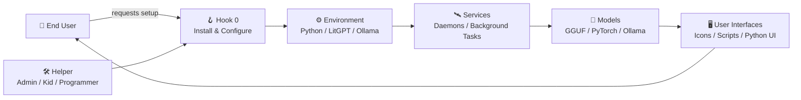
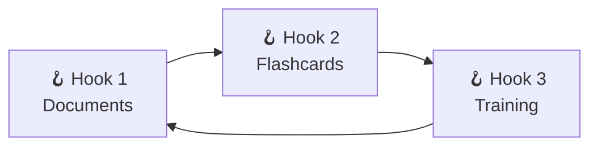
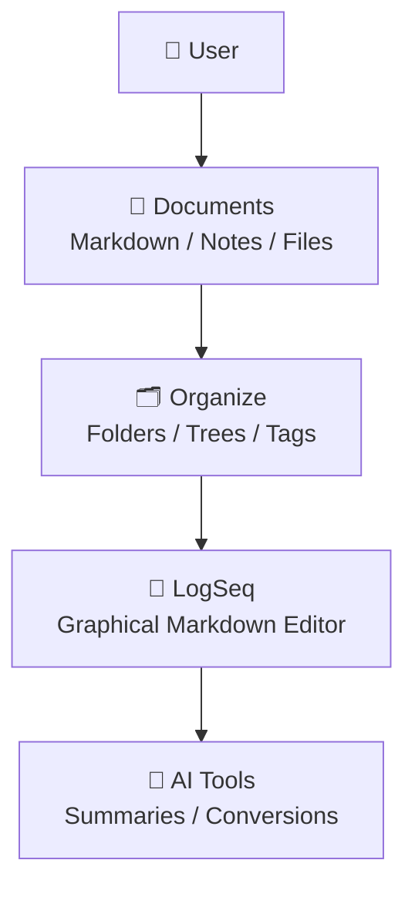
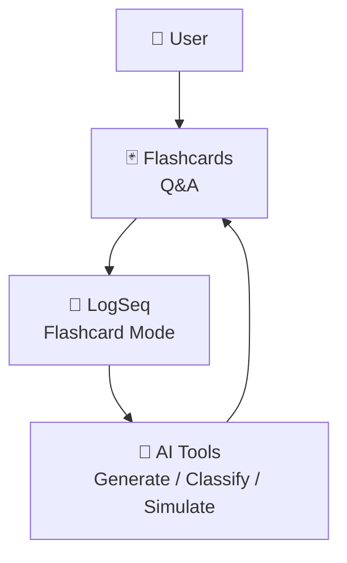
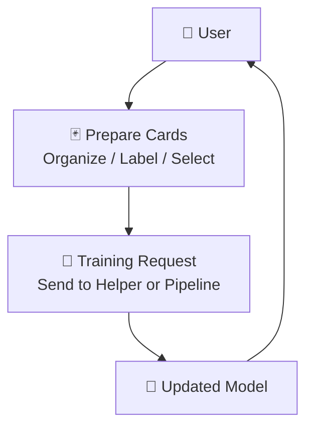
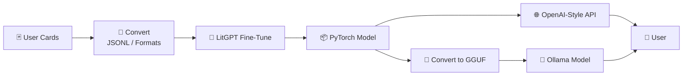
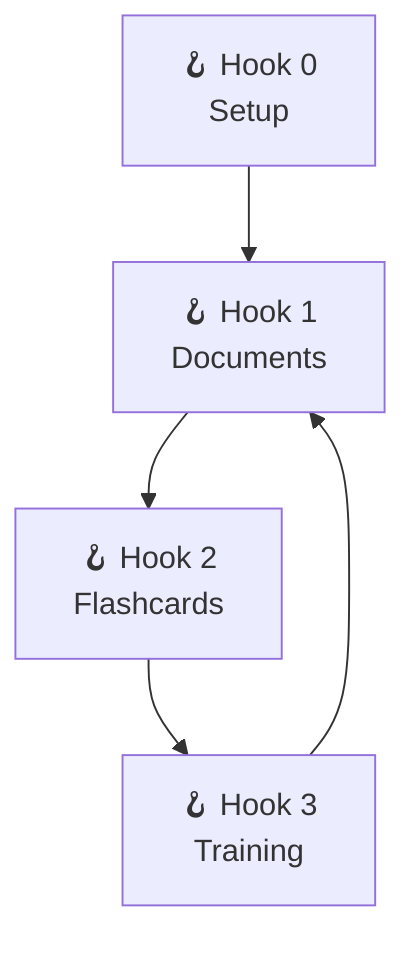
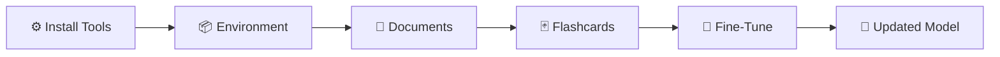
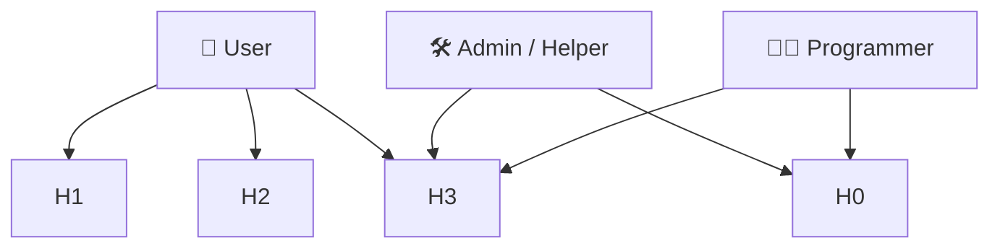

# CoPilot extension *LaegnaAI Book 1 — General Architecture of Hooks & Bones* begins

## 🌿 **Book 1 — General Architecture: Hooks, Bones, and the Flow of Personal AI**

This book gives the *general picture* of the LaegnaAI ecosystem.  
It explains how **Hook 0** prepares the environment, and how **Hooks 1–3** let end users *use*, *shape*, and *train* their personal AI models.

The goal is simple:

> **End users act through hooks.  
> Helpers attach the bones.  
> AI becomes a personal, practical companion.**

This book contains **common diagrams**, **end‑user diagrams**, **technical diagrams**, and **role diagrams**.  
Later books will break each hook into its own detailed diagrams.

---

# 🌱 **1. Hook 0 — Install the Model, Make It Work**

Hook 0 is the *only* place where the user needs help from:

- a tech‑savvy friend  
- a curious child  
- a hobbyist  
- an administrator  
- a programmer  

Hook 0 prepares the environment so that Hooks 1–3 become *simple, human‑friendly actions*.

---

## 🧭 1.1. What it means to “get LitGPT to work”

To install LitGPT and make it usable, helpers:

- install Python  
- install LitGPT  
- download a model  
- configure GPU/CPU settings  
- test inference  
- set up a folder structure  
- create scripts or icons  
- optionally create a Python UI  
- optionally run LitGPT as a background service  

### Example: minimal LitGPT commands

```bash
litgpt download mistral
litgpt infer --model mistral --prompt "Hello"
```

### Example: minimal Ollama commands

```bash
ollama pull mistral
ollama run mistral "Hello"
```

---

## 🧩 1.2. Advanced architecture diagram — Hook 0 in context



Hook 0 creates the **bones**:  
the stable environment where the AI lives.

---

## 🧰 1.3. “Programming” Hook 0 using methods from previous chapters

Helpers can use:

- **pseudoprogramming** (folders as tools)  
- **batch/bash scripts**  
- **Python glue scripts**  
- **trivial UIs** (Tkinter, PySimpleGUI)  
- **service managers** (systemd, launchd, Task Scheduler)  

This turns command‑line AI tools into:

- icons  
- buttons  
- dashboards  
- background services  

---

# 🌿 **2. Hooks 1–3 — Using the Model**

Once Hook 0 is complete, the user can work independently through Hooks 1–3:

1. **Hook 1 — Document Collection**  
2. **Hook 2 — Flashcards & Decks**  
3. **Hook 3 — Training, Fine‑Tuning, Reinforcement**

These hooks form a loop:



---

# 📁 **3. Hook 1 — Document Collection**

Hook 1 is the user’s first *creative* and *organizational* action.

Users:

- collect documents from others  
- create documents on their own  
- verify and update documents  
- maintain their personal library  
- organize documents into folders, trees, or LogSeq graphs  
- share or merge document collections  
- convert documents using AI tools  

This is the “knowledge garden” of the user.

---

## 🧭 3.1. End‑user diagram — Hook 1



---

## 🧰 3.2. LogSeq as the graphical Markdown editor

LogSeq allows users to:

- edit Markdown visually  
- create pages, blocks, lists, headings  
- embed files  
- tag content  
- create backlinks  
- view graph relationships  
- generate flashcards  
- run queries  
- integrate with AI tools  

### Markdown features supported by LitGPT

LitGPT can:

- summarize Markdown  
- convert Markdown  
- extract Q&A  
- generate structured content  
- maintain formatting  
- follow headings and lists  

This makes LogSeq + LitGPT a perfect pair.

---

# 🃏 **4. Hook 2 — Flashcards & Decks**

Hook 2 is where users create *lessons* for their AI.

Users:

- maintain decks of flashcards  
- download decks from others  
- combine decks  
- simulate learning sessions  
- classify cards  
- generate new cards with AI  
- use LogSeq or Anki as graphical editors  

---

## 🧭 4.1. End‑user diagram — Hook 2



---

## 🧰 4.2. LogSeq for flashcards

LogSeq can:

- generate flashcards from lines or blocks  
- ask questions (exam mode)  
- show answers  
- store cards in documents  
- integrate with Ollama for card generation  

### Example: generating flashcards with Ollama

```bash
ollama run mistral "Generate flashcards for this text: ..."
```

### Example: playing flashcards in LogSeq

- LogSeq asks the question  
- user answers mentally  
- LogSeq reveals the answer  
- card is marked as learned or repeated  

---

## 🧩 4.3. Outside the hook — advanced formats

Some tasks require help:

- converting JSONL  
- retrieving Q&A decks from the web  
- merging decks  
- normalizing metadata  
- preparing LitGPT training files  

### Comfort levels

| Task | User | Tweaker | Programmer |
|------|------|---------|------------|
| Edit flashcards | ✔️ | ✔️ | ✔️ |
| Generate cards with AI | ✔️ | ✔️ | ✔️ |
| Convert JSONL | ❌ | ✔️ | ✔️ |
| Prepare LitGPT training data | ❌ | ❌ | ✔️ |
| Build deck automation | ❌ | ✔️ | ✔️ |

---

# 🎓 **5. Hook 3 — Training, Fine‑Tuning, Reinforcement**

Hook 3 is where the user’s AI *learns*.

Users:

- prepare input cards  
- ensure labels and metadata are correct  
- organize decks  
- choose which cards to train  
- send cards to helper or automated pipeline  
- receive updated model  
- interact with improved AI  

---

## 🧭 5.1. End‑user diagram — Hook 3



---

## 🧩 5.2. The “non‑hook” outer process

This is where helpers:

- convert cards to JSONL  
- run LitGPT fine‑tuning  
- convert LitGPT outputs to Ollama formats  
- train GGUF models  
- expose LitGPT models as OpenAI‑compatible APIs  
- maintain training pipelines  
- harmonize decks  
- integrate user cards into larger training sessions  

### Technical diagram



---

## 🧠 5.3. Social and collaborative aspect

Training is not only technical — it is *social*.

- You give your cards → others benefit  
- Others give their cards → you benefit  
- Shared patterns improve communication  
- Personal cards remain private  
- Shared cards improve collective intelligence  

This is how AI becomes a **community tool**.

---

# 🧩 **6. Combined diagrams — end‑user, technical, and roles**

## 6.1. End‑user overview



---

## 6.2. Technical overview



---

## 6.3. Role diagram



---

# 🌱 **Closing**

Book 1 gives the general architecture:

- Hook 0 prepares the environment  
- Hook 1 organizes knowledge  
- Hook 2 creates lessons  
- Hook 3 trains the AI  

This is the foundation of the LaegnaAI ecosystem.  
Next, each hook will receive its own detailed diagrams and explanations.

# CoPilot extension *LaegnaAI Book 1 — General Architecture of Hooks & Bones* ends
