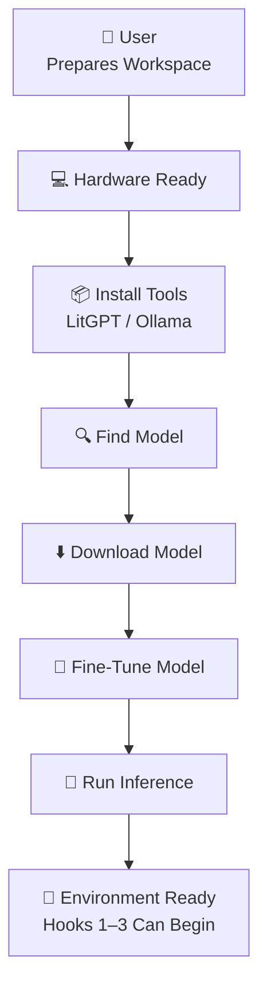

# CoPilot extension *LaegnaAI Hook 0 — Environment Setup Introduction* begins

## 🌱 **Hook 0 — Preparing the Ground: Installing, Running, and Testing Your AI Environment**

Hook 0 is the *foundation* of the entire LaegnaAI ecosystem.  
It is the moment where hardware, software, and a few simple commands come together to create a **workspace** where Hooks 1–3 can operate smoothly.

Hook 0 is not “programming.”  
It is **preparation** — the same way you prepare a desk before studying, or assemble a bicycle before riding.  
Once Hook 0 is complete, the user can:

- collect documents (Hook 1)  
- create flashcards (Hook 2)  
- fine‑tune and reinforce their AI (Hook 3)  

All without touching the deeper technical layers again.

---

# 🧭 1. What Hook 0 Includes

Hook 0 consists of five simple tasks:

1. **Install LitGPT**  
   - command‑line version (required)  
   - Python package version (optional)

2. **Find a model**  
   - choose a base model (Mistral, Llama, Phi, etc.)

3. **Download the model**  
   - using LitGPT or Ollama

4. **Fine‑tune the model**  
   - run a standard training command  
   - verify that training works

5. **Run inference**  
   - test your fine‑tuned model  
   - confirm everything is working

Once these steps are done, the user has a **fully functional AI environment**.

---

# 🧩 2. User‑Flow Diagram — Hook 0



Hook 0 is a **one‑time setup**.  
Maintenance afterward is minimal.

---

# ⚙️ 3. Installing LitGPT

LitGPT can be installed in two ways:

---

## 3.1. **Command‑line installation (required)**

This is the simplest and most universal method.

```bash
pip install litgpt
```

Or, if using a system package manager:

```bash
pipx install litgpt
```

This gives you the `litgpt` command.

---

## 3.2. **Python package installation (optional)**

If you want to write Python scripts that call LitGPT directly:

```bash
pip install litgpt[all]
```

This is optional — many users never need it.

---

# 🔍 4. Finding a Model

LitGPT supports many models:

- Mistral  
- Llama  
- Phi  
- Gemma  
- Qwen  
- Falcon  
- GPT‑NeoX  
- and many others  

You can list available models:

```bash
litgpt list-models
```

Or browse model hubs (HuggingFace, etc.).

---

# ⬇️ 5. Downloading a Model

Once you choose a model:

```bash
litgpt download mistral
```

Or for a specific variant:

```bash
litgpt download mistral-7b-instruct
```

This places the model in your LitGPT workspace.

---

# 🧪 6. Fine‑Tuning a Model

LitGPT includes standard training recipes.

Example:

```bash
litgpt finetune --config configs/finetune/mistral.yaml
```

Or fine‑tune on a small dataset:

```bash
litgpt finetune --config configs/finetune/lora.yaml --data mydata.jsonl
```

This produces a fine‑tuned checkpoint.

---

# 💬 7. Running Inference

Once training is complete:

```bash
litgpt infer --model mistral --prompt "Hello!"
```

Or use your fine‑tuned model:

```bash
litgpt infer --model my-finetuned-model --prompt "Explain my document."
```

If this works, **Hook 0 is complete**.

---

# 🧱 8. Ensuring Prerequisites for Hooks 1–3

Hook 0 ensures:

- the model runs  
- the environment is stable  
- training works  
- inference works  
- files are in the right place  
- the user has a workspace  
- the helper can automate tasks later  

This means Hooks 1–3 can now operate:

- **Hook 1** — documents  
- **Hook 2** — flashcards  
- **Hook 3** — training  

Hook 0 is the *soil* where the rest of the system grows.

---

# 🧰 9. Using Our “Programming” Guide for Hook 0

Hook 0 can be done with:

- command‑line tools  
- batch/bash scripts  
- Python scripts  
- icons and shortcuts  
- simple UIs  

### Example: create an icon to download a model

Windows `.bat`:

```bat
litgpt download mistral
pause
```

Linux `.desktop` launcher:

```bash
#!/usr/bin/env bash
litgpt download mistral
```

macOS Automator:

- “Run Shell Script” → `litgpt download mistral`

### Example: icon to run inference

```bat
litgpt infer --model mistral --prompt "%*"
pause
```

This makes Hook 0 accessible even to non‑technical users.

---

# 🧠 10. Why Many Users Don’t Need a UI

Many users — especially hobbyists, students, and small‑company tech people — are comfortable with:

- terminals  
- commands  
- scripts  
- batch files  
- shell tools  

For them:

- a UI is optional  
- command line is faster  
- automation is easier  
- debugging is clearer  

But for others:

- icons  
- buttons  
- simple dialogs  

…make the experience smoother.

Hook 0 supports both styles.

---

# 🌱 **Closing**

Hook 0 is the beginning of everything:

- install tools  
- download a model  
- fine‑tune  
- run inference  
- confirm everything works  

Once Hook 0 is complete, the user can move freely through Hooks 1–3 — collecting documents, creating flashcards, and training their personal AI.

# CoPilot extension *LaegnaAI Hook 0 — Environment Setup Introduction* ends
