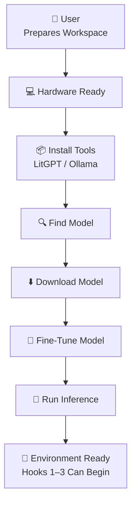
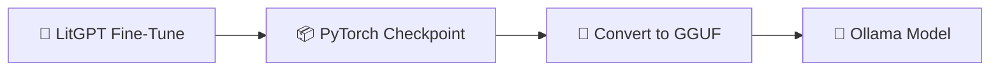
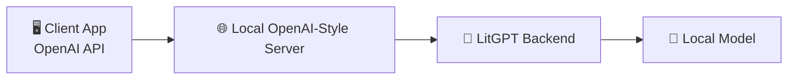
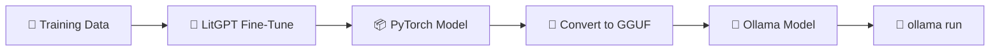
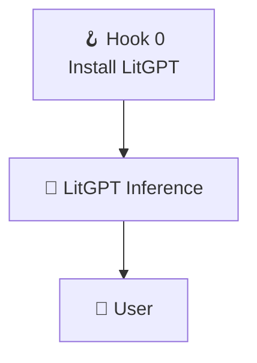
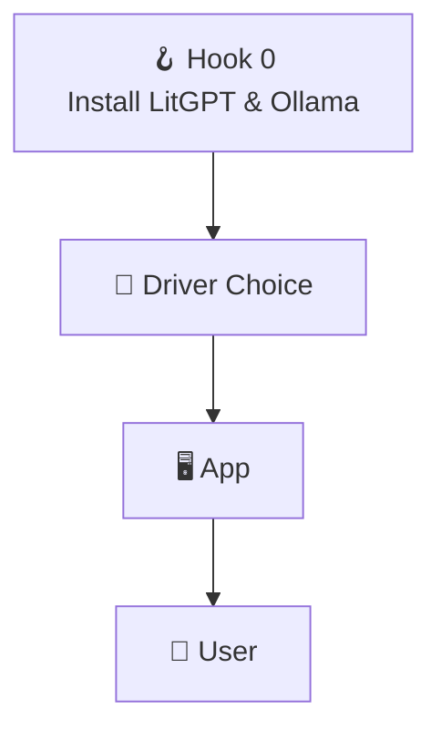
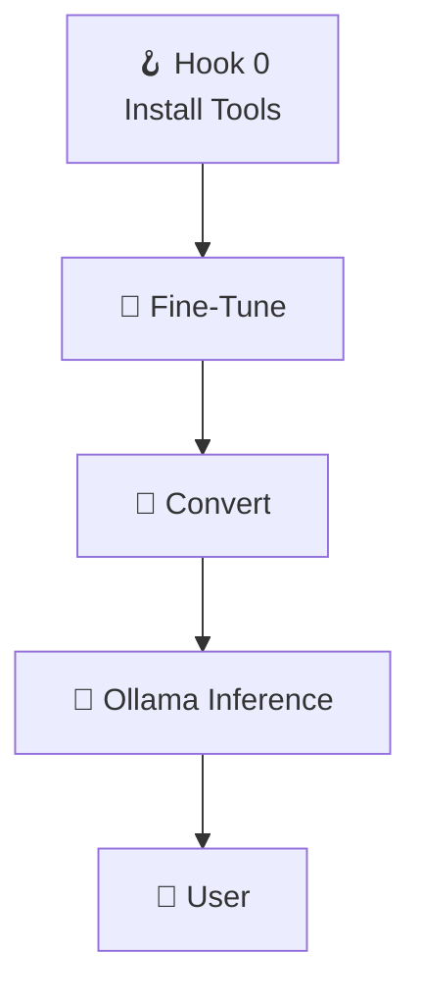
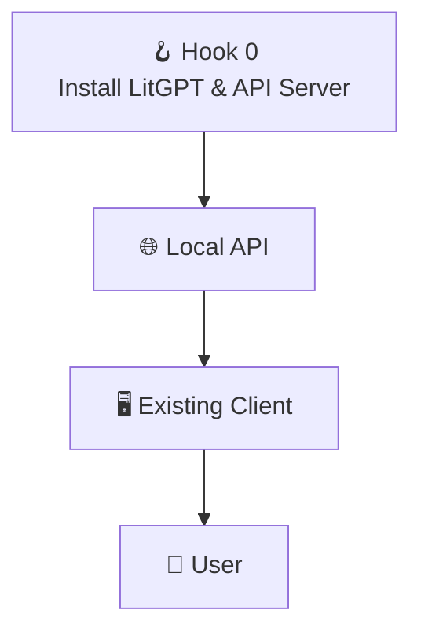

# CoPilot extension *LaegnaAI Hook 0 — Environment Setup Introduction* begins

## 🌱 **Hook 0 — Preparing the Ground: Installing, Running, and Testing Your AI Environment**

Hook 0 is the *foundation* of the entire LaegnaAI ecosystem.  
It is the moment where hardware, software, and a few simple commands come together to create a **workspace** where Hooks 1–3 can operate smoothly.

Hook 0 is not “programming.”  
It is **preparation** — the same way you prepare a desk before studying, or assemble a bicycle before riding.  
Once Hook 0 is complete, the user can:

- collect documents (Hook 1)  
- create flashcards (Hook 2)  
- fine‑tune and reinforce their AI (Hook 3)  

All without touching the deeper technical layers again.

---

# 🧭 1. What Hook 0 Includes

Hook 0 consists of five simple tasks:

1. **Install LitGPT**  
   - command‑line version (required)  
   - Python package version (optional)

2. **Find a model**  
   - choose a base model (Mistral, Llama, Phi, etc.)

3. **Download the model**  
   - using LitGPT or Ollama

4. **Fine‑tune the model**  
   - run a standard training command  
   - verify that training works

5. **Run inference**  
   - test your fine‑tuned model  
   - confirm everything is working

Once these steps are done, the user has a **fully functional AI environment**.

---

# 🧩 2. User‑Flow Diagram — Hook 0



Hook 0 is a **one‑time setup**.  
Maintenance afterward is minimal.

---

# ⚙️ 3. Installing LitGPT

LitGPT can be installed in two ways:

---

## 3.1. **Command‑line installation (required)**

This is the simplest and most universal method.

```bash
pip install litgpt
```

Or, if using a system package manager:

```bash
pipx install litgpt
```

This gives you the `litgpt` command.

---

## 3.2. **Python package installation (optional)**

If you want to write Python scripts that call LitGPT directly:

```bash
pip install litgpt[all]
```

This is optional — many users never need it.

---

# 🔍 4. Finding a Model

LitGPT supports many models:

- Mistral  
- Llama  
- Phi  
- Gemma  
- Qwen  
- Falcon  
- GPT‑NeoX  
- and many others  

You can list available models:

```bash
litgpt list-models
```

Or browse model hubs (HuggingFace, etc.).

---

# ⬇️ 5. Downloading a Model

Once you choose a model:

```bash
litgpt download mistral
```

Or for a specific variant:

```bash
litgpt download mistral-7b-instruct
```

This places the model in your LitGPT workspace.

---

# 🧪 6. Fine‑Tuning a Model

LitGPT includes standard training recipes.

Example:

```bash
litgpt finetune --config configs/finetune/mistral.yaml
```

Or fine‑tune on a small dataset:

```bash
litgpt finetune --config configs/finetune/lora.yaml --data mydata.jsonl
```

This produces a fine‑tuned checkpoint.

---

# 💬 7. Running Inference

Once training is complete:

```bash
litgpt infer --model mistral --prompt "Hello!"
```

Or use your fine‑tuned model:

```bash
litgpt infer --model my-finetuned-model --prompt "Explain my document."
```

If this works, **Hook 0 is complete**.

---

# 🧱 8. Ensuring Prerequisites for Hooks 1–3

Hook 0 ensures:

- the model runs  
- the environment is stable  
- training works  
- inference works  
- files are in the right place  
- the user has a workspace  
- the helper can automate tasks later  

This means Hooks 1–3 can now operate:

- **Hook 1** — documents  
- **Hook 2** — flashcards  
- **Hook 3** — training  

Hook 0 is the *soil* where the rest of the system grows.

---

# 🧰 9. Using Our “Programming” Guide for Hook 0

Hook 0 can be done with:

- command‑line tools  
- batch/bash scripts  
- Python scripts  
- icons and shortcuts  
- simple UIs  

### Example: create an icon to download a model

Windows `.bat`:

```bat
litgpt download mistral
pause
```

Linux `.desktop` launcher:

```bash
#!/usr/bin/env bash
litgpt download mistral
```

macOS Automator:

- “Run Shell Script” → `litgpt download mistral`

### Example: icon to run inference

```bat
litgpt infer --model mistral --prompt "%*"
pause
```

This makes Hook 0 accessible even to non‑technical users.

---

# 🧠 10. Why Many Users Don’t Need a UI

Many users — especially hobbyists, students, and small‑company tech people — are comfortable with:

- terminals  
- commands  
- scripts  
- batch files  
- shell tools  

For them:

- a UI is optional  
- command line is faster  
- automation is easier  
- debugging is clearer  

But for others:

- icons  
- buttons  
- simple dialogs  

…make the experience smoother.

Hook 0 supports both styles.

---

# 🌱 **Closing**

Hook 0 is the beginning of everything:

- install tools  
- download a model  
- fine‑tune  
- run inference  
- confirm everything works  

Once Hook 0 is complete, the user can move freely through Hooks 1–3 — collecting documents, creating flashcards, and training their personal AI.

# CoPilot extension *LaegnaAI Hook 0 — Environment Setup Introduction* ends

# CoPilot extension *LaegnaAI Hook 0 — Inference & Model Plumbing* begins

## 🌱 **Hook 0 Extension — Direct Inference, Drivers, Conversions & Deployment Paths**

This chapter expands Hook 0 by showing how **LitGPT**, **Ollama**, **GGUF**, and **OpenAI‑style APIs** can all be used as interchangeable backends.  
Even though the technical paths differ, the **end‑user hook remains the same**:

> **“I have a model. I want to ask it something.”**

We show:
- direct inference with LitGPT  
- using LitGPT as an alternate driver to Ollama (from Python)  
- converting LitGPT models to Ollama / GGUF  
- exposing LitGPT as an OpenAI‑style API  
- training Ollama directly  
- where Hook 0 sits in each workflow  
- what users, programmers, and admins each care about  

All diagrams follow the same conventions as previous chapters.

---

# 🧠 1. Direct inference with LitGPT

Once LitGPT is installed and a model is downloaded (Hook 0), inference is immediate.

### 1.1. Command‑line inference

```bash
litgpt infer --model mistral --prompt "Hello, LitGPT!"
```

This is the **first test** of a working environment.

### End‑user perspective
- “Does my model answer?”  
- “Is everything installed correctly?”

### Admin perspective
- GPU/CPU availability  
- memory usage  
- correct model path  

### Programmer perspective
- none yet — this is a sanity check.

---

# 🧩 2. Using LitGPT as an alternate driver to Ollama (Python)

If your application already supports **Ollama**, you can add **LitGPT** as a second backend with minimal changes.

## 2.1. Standard backend interface

```python
class AIBackend:
    def infer(self, prompt: str) -> str:
        raise NotImplementedError
```

## 2.2. Ollama driver

```python
import subprocess

class OllamaBackend(AIBackend):
    def __init__(self, model):
        self.model = model

    def infer(self, prompt):
        result = subprocess.run(
            ["ollama", "run", self.model, prompt],
            capture_output=True, text=True
        )
        return result.stdout
```

## 2.3. LitGPT driver

```python
import subprocess

class LitGPTBackend(AIBackend):
    def __init__(self, model):
        self.model = model

    def infer(self, prompt):
        result = subprocess.run(
            ["litgpt", "infer", "--model", self.model, "--prompt", prompt],
            capture_output=True, text=True
        )
        return result.stdout
```

## 2.4. Switching drivers

```python
def get_backend(kind, model):
    if kind == "ollama":
        return OllamaBackend(model)
    if kind == "litgpt":
        return LitGPTBackend(model)
    raise ValueError("Unknown backend")
```

### Hook 0 position
- user or helper chooses backend  
- environment must have the chosen tool installed  

### User questions
- “Which backend am I using?”  
- “Does it answer?”

### Programmer questions
- “Can I keep the same interface?” → Yes.  
- “Do I only change the command?” → Yes.

---

# 🔄 3. Converting LitGPT models to Ollama / GGUF

Many workflows use:

- **LitGPT** for training  
- **Ollama / GGUF** for deployment  

## 3.1. Conversion flow



## 3.2. What you gain

### From LitGPT → GGUF
- portable  
- fast inference  
- compatible with llama.cpp, Kobold, Ollama  

### From GGUF → Ollama
- easy deployment  
- simple CLI  
- web UI  
- local API  

### Hook 0 position
- install conversion tools  
- ensure model loads in Ollama  

### User questions
- “Can I run my model with `ollama run`?”  
- “Does it behave the same?”

---

# 🌐 4. Making LitGPT appear as an OpenAI‑style API

Some apps only speak the **OpenAI API format**.  
LitGPT can be wrapped in a small server that mimics this interface.

## 4.1. Architecture



### Benefits
- existing tools work unchanged  
- only the base URL changes  
- easy to switch between local and cloud models  

### Hook 0 position
- install LitGPT  
- run the local API server  

### User questions
- “Can I use my usual app with my local model?”  
- “Does it behave like OpenAI?”

---

# 🧪 5. Training Ollama directly

Ollama itself is primarily an inference runtime, but some ecosystems allow:

- training externally (LitGPT, Axolotl, etc.)  
- converting to GGUF  
- loading into Ollama  

## 5.1. Typical flow



### Hook 0 position
- install Ollama  
- ensure model loads  
- test inference  

### User questions
- “Can I run my model now?”  
- “Does it answer?”

---

# 🧭 6. Where Hook 0 sits in each workflow

## 6.1. Direct LitGPT inference



## 6.2. LitGPT as alternate driver



## 6.3. Conversion to GGUF / Ollama



## 6.4. OpenAI‑style API



---

# 🧩 7. Questions, problems & roles

## End user
**Questions**
- “Does my model answer?”  
- “Which backend am I using?”  
- “Can I use my favorite app with this model?”

**Problems**
- wrong model  
- wrong backend  
- missing installation  

**Solutions**
- test with simple commands  
- check backend selection  
- verify local API URL  

---

## Programmer
**Questions**
- “How do I add LitGPT as a backend?”  
- “Can I reuse my OpenAI client code?”  

**Problems**
- different CLI arguments  
- different output formats  

**Solutions**
- driver abstraction  
- normalize outputs  

---

## Admin / tech helper
**Questions**
- “Is the environment stable?”  
- “Do we have enough RAM/VRAM?”  

**Problems**
- failed conversions  
- missing dependencies  

**Solutions**
- logs  
- restart scripts  
- clear folder structure  

---

# 🌱 **Closing**

This chapter shows that:

- **LitGPT**, **Ollama**, **GGUF**, and **OpenAI‑style APIs** can all be used interchangeably  
- the **end‑user hook** remains simple: *“I ask; it answers.”*  
- programmers and admins can choose the best backend  
- Hook 0 always ensures the environment is ready for Hooks 1–3  

# CoPilot extension *LaegnaAI Hook 0 — Inference & Model Plumbing* ends
