# CoPilot extension *LaegnaAI Hook 1 — Document Collection* begins

## 🌿 **Hook 1 — Document Collection: Building Your Knowledge Library**

Hook 1 is the user’s first *creative*, *organizational*, and *meaning‑making* action in the LaegnaAI ecosystem.  
Once Hook 0 has prepared the environment, Hook 1 becomes the place where the user:

- acquires documents  
- organizes them  
- checks and updates them  
- contributes to shared collections  
- prepares documents for fine‑tuning  
- generates flashcards  
- serves RAG (Retrieval‑Augmented Generation)  
- uses documents to generate summaries, movies, websites, and other outputs  

Hook 1 is the **knowledge garden** of the user.

---

# 🧭 1. User Workflow Overview

```mermaid
flowchart TD

    U[🙂 User] --> ACQ[📥 Acquire Documents]
    ACQ --> ORG[🗂️ Organize & Maintain Library]
    ORG --> PREP[📝 Prepare for Training<br/>Generate Cards]
    PREP --> RAG[📚 Serve RAG<br/>Document Retrieval]
    RAG --> GEN[🎬 Generate Outputs<br/>Movies / Sites / Texts]
    GEN --> U
```



This loop repeats as the user’s knowledge grows.

---

# 📁 2. General Document Workflow

### 2.1. Acquire  
Users gather documents from:

- their own writing  
- friends and colleagues  
- shared folders  
- exported chats  
- PDFs, Markdown, notes  
- websites or transcripts  

### 2.2. Setup  
Users place documents into:

- folders  
- LogSeq pages  
- Markdown trees  
- project directories  
- shared repositories  

### 2.3. Check  
Users verify:

- formatting  
- completeness  
- duplicates  
- tags  
- metadata  

### 2.4. Contribute  
Users can:

- share documents  
- merge collections  
- create subsets  
- collaborate with others  

### 2.5. Maintain  
Users update:

- new versions  
- corrections  
- reorganized folders  
- new tags  
- new summaries  

This is the **core of Hook 1**.

---

# 🧩 3. Preparing Documents for Fine‑Tuning

Hook 1 feeds Hook 2 and Hook 3.

Users:

- select important passages  
- generate flashcards  
- extract Q&A  
- create summaries  
- convert documents to training formats  
- prepare JSONL (with help)  
- organize decks  

### Diagram: Hook 1 → Hook 2 → Hook 3

```mermaid
flowchart LR

    H1[🪝 Hook 1<br/>Documents] --> H2[🪝 Hook 2<br/>Flashcards]
    H2 --> H3[🪝 Hook 3<br/>Training]
```



---

# 📚 4. Serving RAG (Retrieval‑Augmented Generation)

Users can:

- choose which documents are “active” 
- enable or disable folders  
- tag documents for retrieval  
- run RAG queries  
- generate answers based on their library  

RAG is a **reading assistant** powered by the user’s own documents.

---

# 🎬 5. Generating Outputs from Documents

Users can generate:

- summaries  
- essays  
- websites  
- movie scripts  
- structured data  
- reports  
- templates  

All based on their document collections.

---

# 🧰 6. Background Tools: LogSeq

LogSeq is a **graphical Markdown editor** that supports:

- pages  
- blocks  
- tags  
- backlinks  
- graphs  
- flashcards  
- queries  
- plugins  
- AI integrations  

It is ideal for Hook 1.

---

## 6.1. LogSeq Setup

### Installation

- download LogSeq  
- open a folder as a “graph” 
- LogSeq creates a Markdown workspace  

### Typical models

- daily notes  
- pages for topics  
- hierarchical documents  
- linked references  
- tags  
- flashcards  

---

## 6.2. Creating Flashcards in LogSeq

LogSeq supports flashcards via:

- `{{card}}` blocks  
- `Q:` and `A:` patterns  
- block properties  
- plugins  
- AI‑generated cards  

### Example

```
Q: What is a tensor?
A: A multilinear mapping between vector spaces.
```

Or:

```
- {{card}} What is Hook 1? :: Document collection and organization.
```

---

## 6.3. Creating Other Document Formats

Users can create:

- outlines  
- journals  
- project trees  
- linked notes  
- templates  
- structured documents  

LogSeq stores everything as Markdown.

---

## 6.4. Tags and Tasks

Users can:

- assign tags (`#tag`)  
- create tasks (`TODO`, `DOING`, `DONE`)  
- filter by tag  
- run queries  
- group documents  

This helps maintain large collections.

---

# 🖥️ 7. UI Installation & Setup of LogSeq

### Steps

1. Install LogSeq  
2. Choose a folder as your “graph” 
3. Create pages  
4. Add documents  
5. Tag and link content  
6. Enable flashcards  
7. Integrate with AI tools (optional)  

### Important note  
Even **without** LogSeq, users can:

- create Markdown files  
- organize folders  
- use simple editors  
- prepare documents manually  

LogSeq simply makes it easier.

---

# 🧰 8. Turning Commands Graphical (from our Programming Manual)

Users or helpers can create:

- icons to open LogSeq  
- icons to generate flashcards  
- scripts to convert documents  
- buttons to run RAG queries  
- dashboards for document management  

### Example: icon to summarize a document

```bash
litgpt infer --model my-model --prompt "$(cat selected.md)"
```

### Example: Python UI for document selection

```python
import PySimpleGUI as sg, subprocess

file = sg.popup_get_file("Choose document")
subprocess.run(["litgpt", "infer", "--model", "my-model", "--prompt", open(file).read()])
```

This turns Hook 1 into a **graphical experience**.

---

# 🧭 9. Hook 1 — End‑User Diagram

```mermaid
flowchart TD

    U[🙂 User] --> ACQ[📥 Acquire Docs]
    ACQ --> LOGSEQ[🧩 LogSeq<br/>Edit / Tag / Organize]
    LOGSEQ --> PREP[📝 Prepare for Training<br/>Generate Cards]
    PREP --> RAG[📚 RAG Queries]
    RAG --> GEN[🎬 Generate Outputs]
    GEN --> U
```



---

# 🧩 10. Hook 1 — Technical Diagram

```mermaid
flowchart LR

    FS[📂 File System<br/>Markdown / PDFs / Notes] --> LOGSEQ[🧩 LogSeq]
    LOGSEQ --> META[🏷️ Tags / Properties / Links]
    META --> RAG[📚 RAG Engine]
    RAG --> AI[🧠 LitGPT / Ollama]
    AI --> OUT[📄 Outputs]
```



---

# 🧑‍🤝‍🧑 11. Role Diagram

```mermaid
flowchart TD

    U[🙂 User<br/>Creates & Organizes Docs] --> H1[🪝 Hook 1]

    A[🛠️ Admin<br/>Helps Setup LogSeq / Folders] --> H1

    P[👨‍💻 Programmer<br/>Builds Tools / Scripts] --> H1
```



---

# 🌱 **Closing**

Hook 1 is the foundation of the user’s knowledge ecosystem:

- documents  
- tags  
- flashcards  
- RAG  
- outputs  

It is where the user’s world becomes the AI’s world.

Next chapters will expand Hooks 2 and 3 with the same structure and diagrams.

# CoPilot extension *LaegnaAI Hook 1 — Document Collection* ends

# CoPilot extension *LaegnaAI Hook 1 — Document Conversion & Flashcard Pipelines* begins

## 🌿 **Hook 1 Extension — Converting Documents, Creating Flashcards, and Preparing Training Data**

This chapter expands **Hook 1** into the practical world of **conversion**, **flashcard generation**, and **training‑ready formats**.  
It explains how users and helpers can move documents between:

- **LogSeq → Anki**  
- **LogSeq → JSONL → LitGPT**  
- **Anki → JSONL → LitGPT**  
- **LogSeq → RAG sources**  
- **LogSeq → AI‑generated outputs**  

It also explains how **realtime**, **streaming**, and **database‑style** features of Anki, LitGPT, and JSONL can automate large parts of this workflow.

Hook 1 remains the user’s domain:  
**collect, organize, convert, and prepare documents.**  
Helpers and programmers simply attach the bones.

---

# 🧭 1. User Workflow in This Context

```mermaid
flowchart TD

    U[🙂 User] --> DOCS[📁 LogSeq Documents]
    DOCS --> FC[🃏 Generate Flashcards]
    FC --> ANKI[📦 Export to Anki]
    ANKI --> JSONL[📝 Convert to JSONL]
    JSONL --> LIT[🧪 Feed to LitGPT]
    LIT --> U
```



This is the full “Hook 1 → Hook 2 → Hook 3” pipeline in document form.

---

# 📁 2. Converting LogSeq Documents to Anki Format

LogSeq stores everything as **Markdown**, which is easy to convert.

## 2.1. How users can do it (no programming)

Users can:

- mark flashcards using LogSeq’s built‑in syntax  
- export pages as Markdown  
- use simple tools or plugins to convert Markdown → Anki  
- import into Anki via GUI  

### Example LogSeq flashcard formats

```
Q: What is Hook 1?
A: Document collection and organization.
```

or

```
- {{card}} What is a tensor? :: A multilinear mapping.
```

### User‑friendly conversion tools

- LogSeq plugins (“Flashcards”, “Anki Exporter”)  
- Web converters (Markdown → Anki)  
- Simple scripts provided by helpers  

Users only need to:

- click “Export” 
- import into Anki  
- verify cards  

---

## 2.2. How programmers can do it (simple scripts)

Programmers can write scripts that:

- parse LogSeq Markdown  
- extract Q/A blocks  
- generate Anki `.apkg` or `.csv`  
- automate import/export  

### Example: Markdown → Anki CSV (Python)

```python
import csv, re

with open("notes.md") as f, open("anki.csv", "w", newline="") as out:
    writer = csv.writer(out)
    for line in f:
        m = re.match(r"Q:\s*(.*)", line)
        if m:
            question = m.group(1)
        m = re.match(r"A:\s*(.*)", line)
        if m:
            answer = m.group(1)
            writer.writerow([question, answer])
```

This is trivial programming.

---

# 🧩 3. Converting LogSeq Documents to JSONL for LitGPT

JSONL is the **standard training format** for LitGPT.

### Example JSONL entry

```json
{"instruction": "What is Hook 1?", "output": "Document collection and organization."}
```

## 3.1. How users can do it

Users can:

- export LogSeq pages  
- use a helper’s script  
- use a simple UI tool  
- paste content into a converter  
- let AI generate JSONL from Markdown  

### Example: AI‑assisted conversion prompt

> “Convert this Markdown into JSONL training pairs.”

This is a Hook‑1‑friendly action.

---

## 3.2. How programmers can do it

Programmers can:

- parse Markdown  
- detect Q/A patterns  
- generate JSONL  
- validate formatting  
- merge multiple files  

### Example: Markdown → JSONL (Python)

```python
import json, re

entries = []
with open("notes.md") as f:
    q = None
    for line in f:
        m = re.match(r"Q:\s*(.*)", line)
        if m:
            q = m.group(1)
        m = re.match(r"A:\s*(.*)", line)
        if m and q:
            entries.append({"instruction": q, "output": m.group(1)})
            q = None

with open("train.jsonl", "w") as out:
    for e in entries:
        out.write(json.dumps(e) + "\n")
```

This is the typical helper’s job.

---

# 🧠 4. Realtime, Streaming, and Database Features

Different tools support different levels of automation.

---

## 4.1. Anki

Anki supports:

- realtime deck updates  
- syncing across devices  
- database‑style storage  
- incremental learning  
- tags and metadata  
- plugins for automation  

### Automation potential

- auto‑import new cards  
- auto‑export to JSONL  
- auto‑sync with LogSeq  
- auto‑generate cards with AI  

Helpers can set up these pipelines.

---

## 4.2. LitGPT

LitGPT supports:

- streaming inference  
- streaming training logs  
- incremental fine‑tuning  
- JSONL streaming input  
- large dataset handling  

### Automation potential

- watch a folder for new JSONL  
- auto‑train when new cards appear  
- auto‑convert LogSeq → JSONL → training  
- auto‑deploy updated models  

This is where programmers shine.

---

## 4.3. JSONL

JSONL is:

- append‑friendly  
- stream‑friendly  
- easy to merge  
- easy to generate  
- easy to validate  

### Automation potential

- append new entries as they appear  
- stream into LitGPT  
- merge multiple sources  
- version control (Git)  

JSONL is the “database” of Hook 1.

---

# 🧭 5. Hook 1 in This Conversion Context

```mermaid
flowchart TD

    U[🙂 User<br/>Creates Documents] --> LOGSEQ[🧩 LogSeq]
    LOGSEQ --> FC[🃏 Flashcards]
    FC --> ANKI[📦 Anki Decks]
    ANKI --> JSONL[📝 JSONL Training Data]
    JSONL --> LIT[🧪 LitGPT Training]
    LIT --> U
```



Hook 1 is the **entry point** for all these transformations.

---

# 🧑‍🤝‍🧑 6. Who Can Do What (Personas & Limits)

| Persona | Skills | Can Convert to Anki? | Can Convert to JSONL? | Can Automate? |
|--------|--------|----------------------|------------------------|----------------|
| **End user** | basic computer use | ✔️ via UI | ✔️ via helper tools | ❌ |
| **Tweaker / hobbyist** | scripts, folders | ✔️ | ✔️ | ✔️ simple |
| **Admin / IT helper** | automation, services | ✔️ | ✔️ | ✔️ moderate |
| **Programmer** | Python, parsing | ✔️ | ✔️ | ✔️ full |
| **Professional** | pipelines, infra | ✔️ | ✔️ | ✔️ advanced |

This mirrors the same structure as earlier chapters.

---

# 🧩 7. Professional Context

In a professional environment:

- LogSeq becomes a **knowledge base**  
- Anki becomes a **learning engine**  
- JSONL becomes a **training dataset**  
- LitGPT becomes a **fine‑tuning engine**  
- Ollama becomes a **deployment runtime**  

Teams can:

- share document collections  
- maintain versioned JSONL datasets  
- run automated training pipelines  
- deploy updated models to users  
- integrate with RAG systems  
- build dashboards for monitoring  

Hook 1 remains the **user‑facing entry point** even in enterprise settings.

---

# 🌱 **Closing**

This chapter shows how Hook 1 expands into:

- document conversion  
- flashcard generation  
- JSONL preparation  
- training pipelines  
- realtime and streaming automation  

Hook 1 is where the user’s knowledge becomes **structured**, **trainable**, and **ready for AI**.

# CoPilot extension *LaegnaAI Hook 1 — Document Conversion & Flashcard Pipelines* ends
