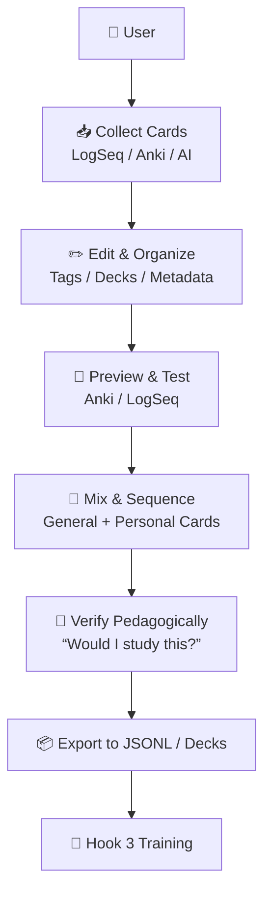
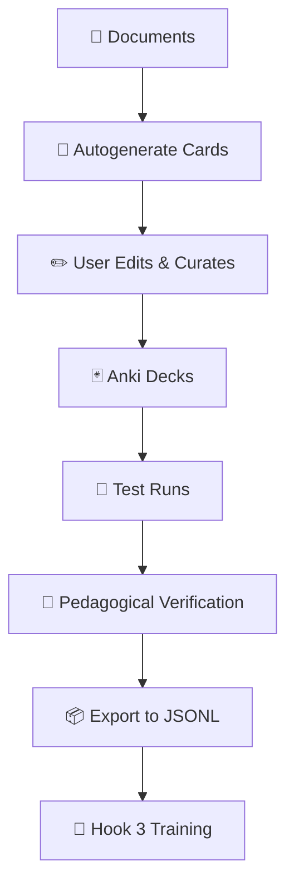
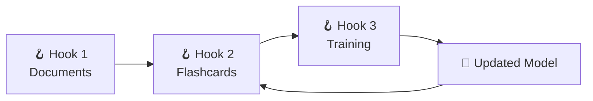

# CoPilot extension *LaegnaAI Hook 2 — Flashcards & Decks* begins

## 🎓 **Hook 2 — Flashcards & Decks: Teaching Your AI the Way You Teach Yourself**

Hook 2 is where the user becomes a **teacher** — not of a child, but of an AI.  
This hook is deeply psychological, pedagogical, and technical at the same time.  
It is the place where:

- users **organize**, **collect**, **edit**, and **preview** flashcards  
- users **test** their cards in Anki or LogSeq  
- users **sequence** their lessons  
- users **mix** general and personal knowledge  
- users **verify** that the cards are the ones *they would study themselves*  
- helpers and programmers **autogenerate**, **normalize**, and **validate** cards  
- admins **maintain** card quality and metadata  
- the AI receives structured, human‑meaningful lessons  

Hook 2 is the bridge between **human pedagogy** and **machine learning**.

---

# 🧭 1. User Workflow for Hook 2



Hook 2 is the **lesson‑building** stage.

---

# 📚 2. Organizing, Collecting & Editing Cards

Users work with two main tools:

- **LogSeq** (Markdown‑based, graphical, block‑structured)  
- **Anki** (flashcard‑based, spaced repetition, deck‑structured)  

Both tools support:

- Q/A cards  
- cloze deletions  
- tags  
- metadata  
- previews  
- test runs  

### 2.1. In LogSeq

Users can:

- create cards inline using `Q:` / `A:`  
- use `{{card}}` blocks  
- tag cards (`#biology`, `#history`)  
- group cards by page  
- embed references  
- generate cards with AI  
- preview cards in “Flashcard Mode”  

### 2.2. In Anki

Users can:

- import decks  
- create new cards  
- edit fields  
- add tags  
- preview cards  
- test themselves  
- reorder or reschedule cards  
- merge decks  
- delete duplicates  

Anki is the **testing ground** for Hook 2.

---

# 🧪 3. Test Runs in LogSeq & Anki

### 3.1. LogSeq Test Runs

LogSeq’s flashcard mode:

- shows the question  
- hides the answer  
- reveals on click  
- tracks progress  
- supports spaced repetition  

This helps users verify:

- clarity  
- correctness  
- formatting  
- difficulty  
- sequencing  

### 3.2. Anki Test Runs

Anki’s preview/test mode:

- shows the card  
- reveals the answer  
- lets user rate difficulty  
- shows scheduling  
- allows editing on the fly  

This is where users check:

- whether the card “feels right”  
- whether the question is clear  
- whether the answer is complete  
- whether the card belongs in this deck  
- whether the deck is balanced  

---

# 🧠 4. Sequencing, Mixing & Pedagogical Verification

This is the heart of Hook 2.

Users must ask:

> **“Would I study this card myself?”**  
> **“Does this deck feel like a real lesson?”**

### 4.1. Sequencing

Users create:

- easy → medium → hard flows  
- thematic clusters  
- chronological sequences  
- conceptual ladders  

### 4.2. Mixing

Users mix:

- personal cards  
- general knowledge cards  
- autogenerated cards  
- cards from others  
- cards from documents  

This creates a **rich, varied training signal**.

### 4.3. Pedagogical Verification

Human pedagogy solves many AI‑training problems:

- **redundancy** → humans remove duplicates  
- **ambiguity** → humans clarify questions  
- **over‑specificity** → humans generalize  
- **under‑specificity** → humans add detail  
- **bias** → humans balance perspectives  
- **gaps** → humans add missing cards  

Teaching an AI is psychologically similar to:

- teaching a child  
- tutoring a friend  
- preparing a lesson  
- writing study notes  

Humans naturally create **balanced**, **meaningful**, **structured** lessons.

---

# 🤖 5. Technical: Autogenerated Cards & Structural Cards

AI tools can autogenerate:

- cards from documents  
- cards from headings  
- cards from paragraphs  
- cards from metadata  
- cards from user cards  
- cards that generalize user cards  
- cards that analogize user cards  

These cards often reveal:

- raw structure  
- implicit patterns  
- missing concepts  
- alternative phrasings  
- deeper relationships  

### 5.1. Why users must verify autogenerated cards

Autogenerated cards may:

- be too literal  
- be too abstract  
- miss context  
- misinterpret nuance  
- duplicate content  
- create noise  

Users verify them in Anki or LogSeq.

---

# 🧩 6. Hook 2 Special Diagram



Hook 2 is the **quality control** stage.

---

# 🧰 7. Technical Deep Dive: Patterns, Prolog‑like Logic & Labeling

### 7.1. Q&A as logical rules

A Q/A pair is a **logical mapping**:

```
Question → Answer
```

This is similar to:

- Prolog rules  
- semantic triples  
- knowledge graphs  
- instruction‑response pairs  

### 7.2. Why human‑logical cards are not enough

If users only create:

- simple  
- human‑logical  
- psychologically intuitive  

cards, the AI may miss:

- edge cases  
- structural patterns  
- generalizations  
- abstractions  
- alternative phrasings  
- negative examples  

### 7.3. Why autogenerated cards matter

Autogenerated cards:

- fill gaps  
- create analogies  
- generate variations  
- expand coverage  
- normalize phrasing  
- create “ideal” cards  

### 7.4. Why programmers/admins must help

They ensure:

- labeling standards  
- JSONL formatting  
- metadata consistency  
- deck normalization  
- deduplication  
- structural coverage  

Without this:

- training quality drops  
- AI becomes brittle  
- lessons become uneven  
- personal style dominates too much  
- generalization suffers  

---

# 🧑‍🤝‍🧑 8. Roles & Responsibilities

| Persona | What They Do | Limits |
|--------|---------------|--------|
| **End user** | create, edit, test cards | cannot normalize JSONL |
| **Tweaker** | merge decks, fix duplicates | limited automation |
| **Admin** | maintain metadata, run scripts | limited pedagogy |
| **Programmer** | autogenerate, convert, validate | needs user’s pedagogy |
| **Teacher‑like user** | sequence lessons, verify flow | cannot automate pipelines |

AI training requires **both**:

- human pedagogy  
- technical structure  

---

# 🧭 9. Hook 2 in the Larger System



Hook 2 is the **lesson‑building** stage that feeds Hook 3.

---

# 🌱 **Closing**

Hook 2 is where:

- human pedagogy  
- common sense  
- psychology  
- technical structure  
- autogenerated patterns  
- metadata  
- sequencing  
- verification  

…all come together to create **real lessons** for the AI.

It is the most human part of the entire system — and the most essential.

# CoPilot extension *LaegnaAI Hook 2 — Flashcards & Decks* ends
