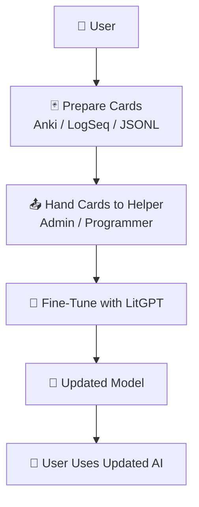
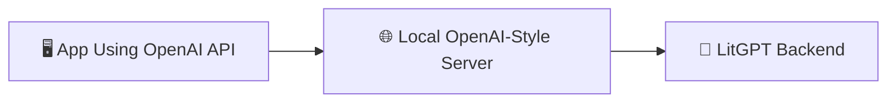
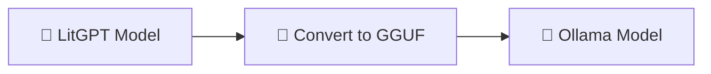
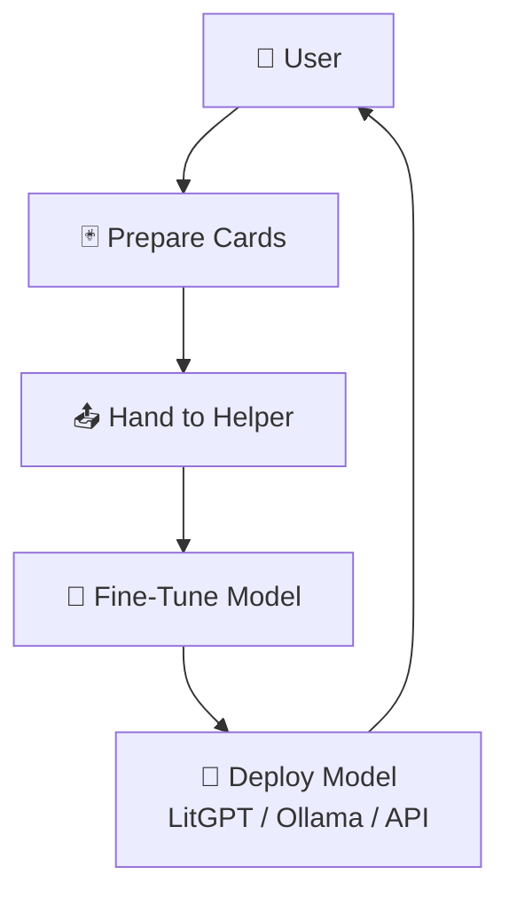
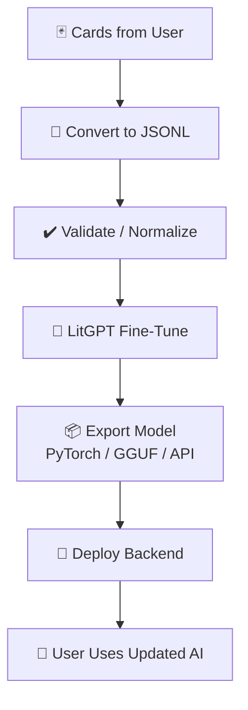

# CoPilot extension *LaegnaAI Hook 3 — Training, Fine‑Tuning & Reinforcement* begins

## 🎓 **Hook 3 — Training Your AI: Turning Flashcards Into a Smarter Model**

Hook 3 is where everything the user has prepared — documents, flashcards, decks, JSONL files — becomes **actual learning** for the AI.  
This is the moment where:

- the user hands their cards to a helper (admin, hobbyist, programmer)  
- the helper converts cards into training data  
- LitGPT (or Ollama, or an OpenAI‑style wrapper) fine‑tunes the model  
- the user receives an updated model  
- the AI becomes more aligned with the user’s knowledge and style  

Hook 3 is the **teaching** stage.

---

# 🧭 1. User Workflow for Hook 3



Hook 3 is simple for the user:  
**prepare → hand off → receive updated model → use it.**

---

# 📤 2. How Users Hand Their Cards to Helpers

Users can hand off their cards in several formats:

### 2.1. Anki Deck (`.apkg`)
- exported from Anki  
- contains all cards, tags, metadata  
- helper converts it to JSONL  

### 2.2. JSONL File
- exported from LogSeq or a converter  
- ready for LitGPT  
- simplest for helpers  

### 2.3. Shared Folder
- Markdown files  
- LogSeq pages  
- raw Q/A lists  
- helper extracts cards  

### 2.4. Cloud or Messaging
- send via email  
- upload to shared drive  
- send via chat  

**User responsibility:**  
- ensure cards are correct  
- ensure decks are organized  
- ensure metadata is meaningful  

**Helper responsibility:**  
- convert  
- validate  
- prepare training data  

---

# 🧩 3. Feeding JSONL to LitGPT (Command Line)

LitGPT accepts JSONL directly.

### 3.1. JSONL format reminder

```json
{"instruction": "What is Hook 3?", "output": "Training and fine‑tuning the AI."}
```

### 3.2. Fine‑tuning command

```bash
litgpt finetune --config configs/finetune/lora.yaml --data train.jsonl
```

### 3.3. Training logs

LitGPT prints:

- loss  
- accuracy  
- steps  
- checkpoints  

Helpers monitor these.

---

# 🧩 4. Converting Anki Decks to JSONL

Helpers convert `.apkg` → JSONL.

### 4.1. Steps

1. Export deck from Anki  
2. Use a converter script  
3. Extract Q/A  
4. Normalize formatting  
5. Save as JSONL  

### 4.2. Example conversion script (conceptual)

```python
# Extract cards from Anki database
# Convert to JSONL entries
```

### 4.3. Why this is “hidden JSONL”
Users never see the JSONL unless they want to.  
Helpers handle it.

---

# 🧠 5. How the Model Extends

Fine‑tuning updates:

- vocabulary usage  
- preferred phrasing  
- domain knowledge  
- personal style  
- problem‑solving patterns  
- memory of user‑specific concepts  

The model becomes:

- more aligned  
- more helpful  
- more consistent  
- more personal  

---

# 🛰️ 6. Serving LitGPT After Training

Helpers can deploy the updated model in several ways.

---

## 6.1. Direct LitGPT Inference

```bash
litgpt infer --model my-finetuned-model --prompt "Explain my notes."
```

### User experience
- run a script  
- click an icon  
- use a Python UI  

---

## 6.2. Updating the Driver (Python)

If the user’s app uses a backend driver:

```python
backend = LitGPTBackend("my-finetuned-model")
```

This switches the model instantly.

---

## 6.3. Mocking OpenAI API

Helpers can run a local server:



User keeps using their app normally.

---

## 6.4. Using Ollama as Deployment

Helpers convert:



Then user runs:

```bash
ollama run my-finetuned-model
```

---

# 🧭 7. Hook 3 — End‑User Diagram



---

# 🛠️ 8. Hook 3 — Helper / Professional Diagram



---

# 🧑‍🤝‍🧑 9. Roles & Responsibilities

| Persona | Responsibilities | Limits |
|--------|------------------|--------|
| **End user** | create cards, verify content, hand off | cannot run training |
| **Hobbyist** | convert decks, run simple training | limited deployment |
| **Admin** | manage environment, deploy models | limited pedagogy |
| **Programmer** | automate conversion, build drivers | needs user’s content |
| **Professional** | full pipeline, optimization | depends on user’s cards |

Training is a **collaboration**.

---

# 🌱 **Closing**

Hook 3 is where:

- user knowledge  
- human pedagogy  
- structured flashcards  
- technical pipelines  
- LitGPT fine‑tuning  
- deployment choices  

…all converge to create a **personal AI model**.

The user teaches.  
The helper structures.  
The AI learns.

# CoPilot extension *LaegnaAI Hook 3 — Training, Fine‑Tuning & Reinforcement* ends
