# The first sight..

..is inference: as well, "l" is good in alphabet after "b" and "h", so it's ordered alphabetically - the files. A fine poetry landscape to organize my files and titles, well good with my laziness: I was good at poetry when child, but now I cannot concentrate a lot - I create file names :) Well into tech..

In the first sight, Look1, an A.I. is mostly *about* inference. This is step 0: we basically set up all the tools into inference; and step 3: we get into inference again, when A.I. is trained on our flashcards.

Altough: inference *is not* a **Hook**: it's the ***Ship*** itself. It's the point where we start, and the point, where we end.

User activities:
1. **User activity 1** (preparation hook) => *Document Collection*; Based on ***Hook 1***
2. **User activity 2** (involvement hook) => *Flashcards & Decks*; Based on ***Hook 2***
3. **User activity 3** / main activity (destiny hook) => *Inference, Chat & Deploy*; Based on ***Hooks 0*** and ***3***, as well as online examples and trials.

# ⭐ Chapter: The Destiny Hook — Where Everything Begins and Returns

Activity 3 is the **destiny hook** — the place where users finally *live* with their AI.  
It is the **beginning and the end** of the entire hook system:  
the point where preparation becomes experience, and experience becomes new preparation.

This chapter introduces Activity 3 in a friendly, popular way, showing how users naturally flow into it, and how it quietly depends on the meaning they give to Activities 1 and 2.

---

## 🌌 1. What Is the Destiny Hook?

The destiny hook is the moment when the AI stops being a project and becomes a **presence**.  
It is where users:

- 💬 **Chat**  
- 🧠 **Infer**  
- 🚀 **Deploy**  
- 🔄 **Loop back** into improving their documents and flashcards  

This is the hook where the AI becomes *useful*, *personal*, and *alive* in daily life.

Even though it feels like the “final step,” it is actually the **center of gravity** of the whole system.

---

## 🔁 2. Why Activity 3 Is Both the Beginning and the End

Users usually start here — they want to talk to an AI, get help, solve tasks, explore ideas.  
This desire is the **spark** that motivates Activities 1 and 2.

But Activity 3 also becomes the **destination**:

- Every chat reveals missing documents → back to Activity 1  
- Every misunderstanding reveals missing flashcards → back to Activity 2  
- Every improvement in Activities 1 and 2 makes Activity 3 richer  

The destiny hook is the **heartbeat** of the loop.

---

## 🧭 3. How Users Melt Naturally Into Activity 3

Most users don’t think in terms of “hooks.” 
They simply want to:

- Ask something  
- Get something done  
- Understand something  
- Create something  

This is why Activity 3 feels natural:  
it matches the way humans already interact with tools, assistants, and each other.

But to make Activity 3 *meaningful*, users must give meaning to Activities 1 and 2:

- 🗂️ **Documents** give the AI memory-like grounding  
- 🃏 **Flashcards** give the AI clarity and precision  
- 💬 **Inference** gives the AI life  

Without Activities 1 and 2, Activity 3 becomes generic.  
With them, it becomes *theirs*.

---

## 🔧 4. The Destiny Hook in the System (Mermaid Diagram)

Below is a simple interaction diagram showing how Activity 3 sits at the center of the user–tech loop.

```mermaid
flowchart TD

    U[👤 User] -->|Chats, Asks, Creates| A3[⭐ Activity 3<br/>Inference · Chat · Deploy]

    A3 -->|Finds gaps| A1[📁 Activity 1<br/>Document Collection]
    A3 -->|Finds misunderstandings| A2[🃏 Activity 2<br/>Flashcards & Decks]

    A1 -->|Improves grounding| A3
    A2 -->|Improves clarity| A3

    subgraph Tech[🖥️ Tech & Helpers]
        H0[⚙️ Hook 0<br/>Setup & Install]
        H3[🔧 Hook 3<br/>Training & Deployment]
    end

    A3 -->|Uses| H3
    H3 -->|Supports| A3
    H0 -->|Enables| H3
```

---

## 🌱 5. The Human Meaning of the Destiny Hook

Activity 3 is where users:

- Feel the AI responding to *their* world  
- See their documents reflected back with intelligence  
- Experience the value of the flashcards they curated  
- Build trust and rhythm with the system  

It is the **human-facing surface** of the entire architecture.

This is why we call it the **destiny hook**:  
it is where the AI becomes part of the user’s destiny — their work, their creativity, their thinking.

---

## 🧩 6. What Comes Next

In the next chapter, we explore **end‑user inference styles**:

- Conversational inference  
- Task inference  
- Creative inference  
- Analytical inference  
- Workflow inference  
- And more  

These are the “faces” of Activity 3 — the ways users actually *live* inside the destiny hook.

# 🔮 Understanding Inference — The Engine of Activity 3

Inference is the quiet force behind every AI interaction.  
Whenever a user *talks* to an AI, *asks* for help, or *uses* an AI‑powered tool, something in the background is performing **inference** — the act of taking input and producing intelligent output.

Inference is the **core mechanism** of Activity 3, because Activity 3 is where users finally *use* the AI they prepared in Activities 1 and 2.

---

## 🧠 1. What “Inference” Really Means

At its simplest:

> **Inference = a model thinking in real time.**

When a user types a message, the model:
- reads the text  
- interprets it  
- predicts the next tokens  
- forms a response  

This happens inside an **inference server** or **local model runtime**.

Without inference, there is no chat, no coding assistant, no bot, no tool intelligence.

---

## 💬 2. Chat Clients Use Inference

Every chat client — from a simple terminal prompt to a polished web UI — is just a **window** into an inference engine.

Examples:
- A browser‑based chat UI  
- A desktop chat app  
- A terminal client  
- A mobile app  

All of them rely on the same thing:  
**a running model that performs inference**.

The user sees the chat bubble, but the real work happens in the inference backend.

---

## 🧩 3. IDEs and Tools Connect to Inference Services

Modern tools like **VSCode**, **Cursor**, **Zed**, and others include AI assistants.  
These assistants do not contain intelligence themselves — they **connect to an inference service**.

### 🛠️ Example: Coding Assistants (e.g., Cascade in VSCode)

A coding assistant needs:
- a **compatible model** (e.g., a coding‑tuned LLM)  
- a **server** that can host it (Ollama, LitGPT, LM Studio, GPT4All, etc.)  
- a **configuration** that tells the IDE how to talk to the server  

Once connected, the assistant can:
- autocomplete code  
- explain errors  
- generate functions  
- refactor files  
- chat about the project  

All of this is powered by inference.

---

## 🔗 4. Many Clients, One Model — Interchangeable Ecosystem

Inference systems are flexible.  
A single model can be served by multiple runtimes, and multiple clients can connect to the same runtime.

### 🌀 Example: Ollama & LitGPT

If you run a model in Ollama:
- OpenUI can connect  
- VSCode extensions can connect  
- Terminal chat clients can connect  
- Python scripts can connect  
- Custom bots can connect  

If you run the same model in LitGPT:
- The same clients can connect  
- Or different clients can connect  

### 🔄 Model Interchangeability

A **GGUF** model:
- runs in Ollama  
- runs in GPT4All  
- runs in LM Studio  
- runs in llama.cpp  
- runs in many other runtimes  

This means the user can choose:
- the runtime they like  
- the UI they like  
- the workflow they like  

All powered by the same underlying inference.

---

## 🧰 5. Toolkits Use Inference as Their “Brain”

Many toolkits embed AI as a component:
- note‑taking apps  
- research assistants  
- writing tools  
- automation frameworks  
- personal knowledge systems  
- chatbots with memory  
- agents and workflows  

These tools don’t “contain” intelligence — they **call** an inference server.

Inference is their **brain**, the toolkit is their **body**.

---

## 🖥️ 6. End‑User Programs Use Deployed Models

Once a model is deployed:
- a GUI app can use it  
- a web service can use it  
- a CLI tool can use it  
- a script can use it  
- a child learning to code can use it  

This is why Activity 3 is so broad:  
**anything that uses the model for real work belongs here.**

---

## 🌟 7. Why All This Belongs to Activity 3

Activity 3 is the **destiny hook** — the place where the AI becomes part of daily life.

Every one of these actions is an end‑user activity:
- chatting  
- coding  
- using bots  
- using assistants  
- running tools  
- building small programs  
- connecting apps to the model  
- experimenting with different clients  

They all rely on the same thing:

> **The inference system is running, and the user is interacting with it.**

This is why Activity 3 is the “home” of all real AI usage.

---

## 👶 8. Even Your Programmer Child Can Use It

Once the inference server is running, even a beginner programmer can:
- write a small Python script  
- connect to the model  
- send a prompt  
- receive a response  
- build a bot  
- build a helper tool  
- build a game NPC  
- build a personal assistant  

The same inference system that powers your chat also powers their creativity.

Inference is the **shared foundation** for all users — casual, professional, or learning.

---

## 🧭 9. Summary

Inference is:
- the engine of Activity 3  
- the real‑time thinking of the model  
- the shared backend for all AI tools  
- the reason chat, coding assistants, bots, and toolkits work  
- the place where users finally *use* the AI they prepared in Activities 1 and 2  

Activity 3 is where everything comes together.

