# 🌿 LaegnaAIHooksAndBones — Main Module Overview

This module introduces the **three essential user activities** of Laegna AI:  
**Inference Chat**, **Collecting Documents**, and **Working on Flashcard Decks**.  
These three activities form a complete, human‑centered loop. You chat with the AI, you give it meaningful context through documents, and you shape its intelligence through flashcards. Everything in this module supports that cycle.

The chapters below guide you through the workflow in a natural reading order. Each chapter includes a link, a flowing explanation, a summary, and diagrams that help you understand how the pieces fit together.

---

## 🔺 The Three Activities Diagram

```mermaid
flowchart TD
    A3["💬 Inference Chat"]:::green
    A1["📁 Document Collection"]:::blue
    A2["🃏 Flashcard & Deck Work"]:::yellow

    A3 --> A1
    A3 --> A2
    A1 --> A3
    A2 --> A3

    classDef green fill:#9be7a5,stroke:#2e7d32,color:#000;
    classDef blue fill:#90caf9,stroke:#1565c0,color:#000;
    classDef yellow fill:#fff59d,stroke:#f9a825,color:#000;
```

Or as a triangle:

```mermaid
graph TD
    A3("💬 Inference Chat"):::green
    A1("📁 Document Collection"):::blue
    A2("🃏 Flashcard Deck Work"):::yellow

    A3 --- A1
    A1 --- A2
    A2 --- A3

    classDef green fill:#9be7a5,stroke:#2e7d32,color:#000;
    classDef blue fill:#90caf9,stroke:#1565c0,color:#000;
    classDef yellow fill:#fff59d,stroke:#f9a825,color:#000;
```

Inference at the top, Documents at the left‑bottom, Flashcards at the right‑bottom — the three equal pillars of the user workflow.

---

# 📚 Chapters

Below are the chapters of the LaegnaAIHooksAndBones module, in the order you provided.  
Each chapter flows into the next, forming a continuous narrative of how users work with their AI.

---

## 1. **Chapter 1 — General Overview**  
[`Book1General.md`](Book1General.md)

This opening chapter introduces the philosophy of Laegna AI: simple hooks for users, stable bones beneath them, and a workflow that grows naturally from everyday tasks. It explains why the system is built around three activities and how users can approach AI without needing technical expertise. The chapter sets the tone for the entire module: approachable, structured, and grounded in real human work.

> **Summary:**  
> A gentle introduction to the Laegna AI workflow and the three activities that shape all user interaction.

---

## 2. **Chapter 2 — Choosing Models**  
[`Choice1Modelslist.md`](Choice1Modelslist.md)

This chapter helps users understand the landscape of AI models: tiny, small, medium, large, offline, online, and hybrid. It explains how to choose models based on hardware, needs, and workflow. The chapter flows from general philosophy into practical selection, showing how the right model supports the three activities. It also introduces the idea of having multiple models for different tasks.

```mermaid
flowchart LR
    U[👤 User]:::red --> M[🧠 Choose Models]:::blackbox
    M --> A3[💬 Inference Chat]:::green

    classDef red fill:#ff8a80,stroke:#b71c1c,color:#000;
    classDef green fill:#9be7a5,stroke:#2e7d32,color:#000;
    classDef blackbox fill:#000000,stroke:#424242,color:#ffffff;
```

> **Summary:**  
> A practical guide to selecting offline and online models that support your daily AI workflow.

---

## 3. **Chapter 3 — Hook 0: Setup & Installation**  
[`Hook0SetupInstallation.md`](Hook0SetupInstallation.md)

This chapter explains the only technical hook: preparing the environment. It describes how a helper or tech‑savvy person installs runtimes, models, and tools so the user can later work comfortably in Activities 1–3. The chapter flows from model choice into preparing the system, emphasizing that users do not need to understand the technical details — only where their hooks are.

```mermaid
flowchart LR
    U[👤 User]:::red --> T[🛠️ Technician / Admin]:::grey
    T --> A3[💬 Inference Chat]:::green

    classDef red fill:#ff8a80,stroke:#b71c1c,color:#000;
    classDef grey fill:#e0e0e0,stroke:#616161,color:#000;
    classDef green fill:#9be7a5,stroke:#2e7d32,color:#000;
```

> **Summary:**  
> The technical foundation that enables all user activities, handled once and then forgotten.

---

## 4. **Chapter 4 — Hook 1: Document Collection (Activity 1)**  
[`Hook1DocumentCollection.md`](Hook1DocumentCollection.md)

This chapter introduces the first true user activity: collecting documents. It explains how users build their “library of the self” — notes, bios, project folders, structured text — and how this gives the AI grounding. The chapter flows from setup into meaningful content creation, showing how documents become the AI’s world.

> **Summary:**  
> Documents give the AI context and grounding; they are the user’s first major contribution.

---

## 5. **Chapter 5 — Hook 2: Flashcards & Decks (Activity 2)**  
[`Hook2FlashcardsDecks.md`](Hook2FlashcardsDecks.md)

This chapter explains how users turn documents into structured lessons. Flashcards teach the AI how to answer, how to reason, and how to reflect the user’s style. The chapter flows naturally from document collection into structured learning, showing how flashcards shape the AI’s intelligence.

```mermaid
flowchart LR
    D[👤📁 User Documents]:::red --> F[🃏 Flashcard Decks]:::yellow
    F --> A3[💬 Inference Chat]:::green

    classDef red fill:#ff8a80,stroke:#b71c1c,color:#000;
    classDef green fill:#9be7a5,stroke:#2e7d32,color:#000;
    classDef yellow fill:#fff59d,stroke:#f9a825,color:#000;
```

> **Summary:**  
> Flashcards are the curriculum that trains the AI to think in your way.

---

## 6. **Chapter 6 — Hook 3: Training & Finetuning**  
[`Hook3TrainingFinetuning.md`](Hook3TrainingFinetuning.md)

This chapter describes how helpers or advanced users train or finetune models using the flashcards and documents prepared earlier. It explains how training fits into the loop: not as a constant activity, but as an occasional upgrade that strengthens the AI’s abilities. The chapter flows from flashcards into deeper model shaping.

```mermaid
flowchart LR
    %% Nodes
    D[👤📁 User Documents]:::red --> F[🃏 Flashcard Decks]:::yellow

    %% Primary path: Decks → Chat
    F --> A3[💬 Inference Chat]:::green

    %% Alternative path: Decks → Trainer → Chat
    F -.-> T[🛠️ Technician / Trainer]:::grey
    T --> A3

    %% Styles
    classDef red fill:#ff8a80,stroke:#b71c1c,color:#000;
    classDef yellow fill:#fff59d,stroke:#f9a825,color:#000;
    classDef grey fill:#e0e0e0,stroke:#616161,color:#000;
    classDef green fill:#9be7a5,stroke:#2e7d32,color:#000;
```

> **Summary:**  
> Training is the behind‑the‑scenes process that turns your documents and flashcards into improved model behavior.

---

## 7. **Chapter 7 — Inference Chat (Activity 3)**  
[`Look1Inference.md`](Look1Inference.md)

This final chapter brings everything together. It explains how users interact with the AI through chat, coding assistants, bots, and tools. It shows how inference is both the beginning and the end of the loop: the place where users live with the AI, and the place where they discover what to improve in documents and flashcards. The chapter completes the narrative by returning to the top of the triangle.

> **Summary:**  
> Inference Chat is where the AI becomes useful, personal, and alive — the heart of the user workflow.

---

# 🧩 Understanding the Three-Part Process

Together, the chapters teach the user how to:

- provide **context** through documents  
- provide **clarity** through flashcards  
- experience **intelligence** through inference  

These three activities form a complete, stable loop.  
Users “hook into” the AI by contributing meaning, structure, and interaction.

---

# 🧠 Questions & Puzzles to Test Understanding

By the end of this module, a user should be able to answer:

1. What are the three user activities, and why are they equal?  
2. Why does the AI need your documents?  
3. What makes a flashcard effective?  
4. How does inference reveal gaps in your documents or flashcards?  
5. Why is setup (Hook 0) separate from user activities?  
6. How do different model sizes affect Activities 1–3?  
7. What is the loop between chat → documents → flashcards → chat?  
8. How does training fit into the workflow without overwhelming the user?  

---

# 🏡 What You Can Work on at Home or in the Workspace

Here are practical tasks to deepen your understanding:

- Build a small document collection about yourself or a project  
- Create a flashcard deck from those documents  
- Test a tiny model and map its limits  
- Compare a small offline model with a large online model  
- Try different chat clients (VSCode, terminal, web UI)  
- Experiment with prompt formats for flashcards  
- Create a mini‑curriculum:  
  - 1 document  
  - 1 deck  
  - 1 chat session  
- Observe how inference changes when you improve your documents  

These tasks help you internalize the full workflow of LaegnaAIHooksAndBones.

